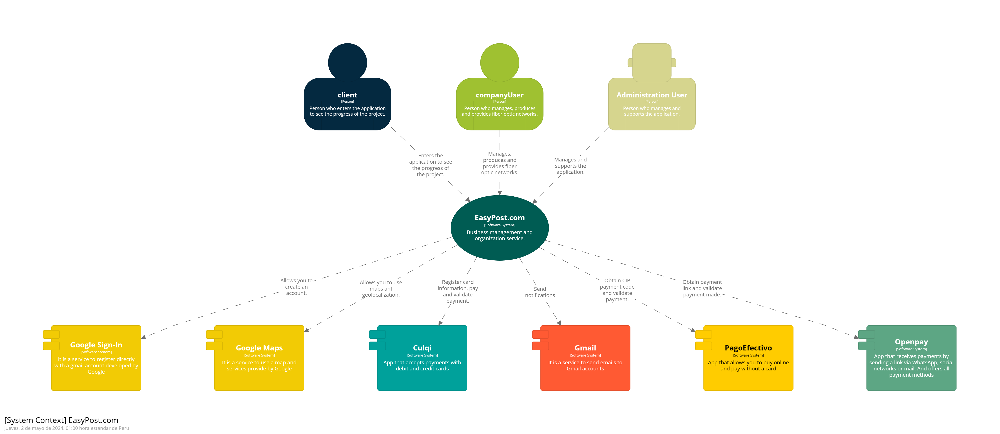
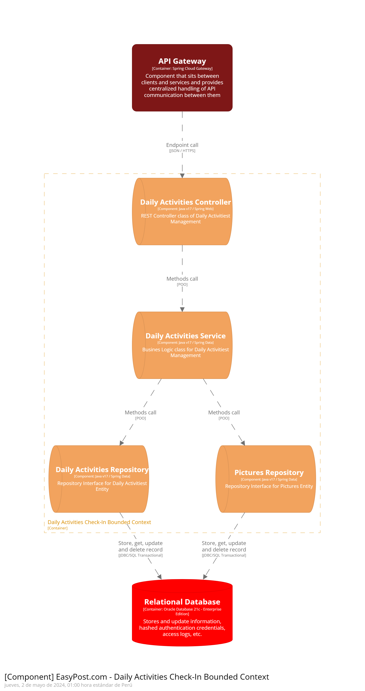

Universidad Peruana de Ciencias Aplicadas

Carrera: Ingeniería de Software

Ciclo: 2024-01

Curso: Aplicaciones Web

Sección: WX56

Profesor: Alex Humberto Sánchez Ponce

Informe del Trabajo Final

Startup: InnovaTec

Producto: EasyPost

Integrantes:
- 
-
-
-
- Ybañez Esquerre, Miguel Angel - U20201B298
- Carlos Edward, Avellaneda Ramos - U201923994

Junio del 2024

---
# Registro de Versiones del Informe

---
# Project Report Collaboration Insights

---
# Student Outcome
El curso contribuye al cumplimiento del Student Outcome ABET: **ABET – EAC - Student Outcome 3**   Criterio: *Capacidad de comunicarse efectivamente con un rango de audiencias.*

En el siguiente cuadro se describe las acciones realizadas y enunciados de conclusiones por parte del grupo, que permiten sustentar el haber alcanzado el logro del ABET – EAC - Student Outcome 3.

| Criterio específico | Acciones realizadas | Conclusiones |
| - | - | - |
| Comunica oralmente sus ideas y/o resultados con objetividad a público de diferentes especialidades y niveles jerarquicos, en el marco del desarrollo de un proyecto en ingeniería. | **Apellido Apellido Nombre Nombre**   ***TB1:*** Morbi vel tortor id eros dictum venenatis id ut dui.Mauris quis tellus sed nunc hendrerit vehicula ac id mauris.   ***TP:*** Morbi vel tortor id eros dictum venenatis id ut dui.Mauris quis tellus sed nunc hendrerit vehicula ac id mauris.   ***TB2:*** Morbi vel tortor id eros dictum venenatis id ut dui.Mauris quis tellus sed nunc hendrerit vehicula ac id mauris.   ***TF:*** Morbi vel tortor id eros dictum venenatis id ut dui.Mauris quis tellus sed nunc hendrerit vehicula ac id mauris.    **Apellido Apellido Nombre Nombre**   ***TB1:*** Morbi vel tortor id eros dictum venenatis id ut dui.Mauris quis tellus sed nunc hendrerit vehicula ac id mauris.   ***TP:*** Morbi vel tortor id eros dictum venenatis id ut dui.Mauris quis tellus sed nunc hendrerit vehicula ac id mauris.   ***TB2:*** Morbi vel tortor id eros dictum venenatis id ut dui.Mauris quis tellus sed nunc hendrerit vehicula ac id mauris.   ***TF:*** Morbi vel tortor id eros dictum venenatis id ut dui.Mauris quis tellus sed nunc hendrerit vehicula ac id mauris.    | ***TB1:*** Fusce cursus dolor et nulla suscipit, sit amet ullamcorper nibh vestibulum.    ***TP:*** Fusce cursus dolor et nulla suscipit, sit amet ullamcorper nibh vestibulum.    ***TB2:*** Fusce cursus dolor et nulla suscipit, sit amet ullamcorper nibh vestibulum.    ***TF:*** Fusce cursus dolor et nulla suscipit, sit amet ullamcorper nibh vestibulum. | 
| Comunica en forma escrita ideas y/o resultados con objetividad a público de diferentes especialidades y niveles jerarquicos, en el marco del desarrollo de un proyecto en ingeniería. | ***Apellido Apellido Nombre Nombre***   ***TB1:*** Cras sed diam suscipit, malesuada ex rutrum, fringilla orci. Vestibulum in nunc quis elit suscipit sollicitudin.   ***TP:*** Cras sed diam suscipit, malesuada ex rutrum, fringilla orci. Vestibulum in nunc quis elit suscipit sollicitudin.   ***TB2:*** Cras sed diam suscipit, malesuada ex rutrum, fringilla orci. Vestibulum in nunc quis elit suscipit sollicitudin.   ***TF:*** Cras sed diam suscipit, malesuada ex rutrum, fringilla orci. Vestibulum in nunc quis elit suscipit sollicitudin.    ***Apellido Apellido Nombre Nombre***   ***TB1:*** Cras sed diam suscipit, malesuada ex rutrum, fringilla orci. Vestibulum in nunc quis elit suscipit sollicitudin.   ***TP:*** Cras sed diam suscipit, malesuada ex rutrum, fringilla orci. Vestibulum in nunc quis elit suscipit sollicitudin.   ***TB2:*** Cras sed diam suscipit, malesuada ex rutrum, fringilla orci. Vestibulum in nunc quis elit suscipit sollicitudin.   ***TF:*** Cras sed diam suscipit, malesuada ex rutrum, fringilla orci. Vestibulum in nunc quis elit suscipit sollicitudin. | ***TB1:*** FEtiam imperdiet quam condimentum velit tempor porttitor.    ***TP:*** FEtiam imperdiet quam condimentum velit tempor porttitor.    ***TB2:*** FEtiam imperdiet quam condimentum velit tempor porttitor.    ***TF:*** FEtiam imperdiet quam condimentum velit tempor porttitor. |

---
# Contenido
## Tabla de contenidos

### [Capítulo I: Introducción](#capítulo-i-introducción)
- [1.1. Startup Profile](#11-startup-profile)
    - [1.1.1 Descripción de la Startup](#111-descripción-de-la-startup)
    - [1.1.2 Perfiles de integrantes del equipo](#112-perfiles-de-integrantes-del-equipo)
- [1.2 Solution Profile](#12-solution-profile)
    - [1.2.1 Antecedentes y problemática](#121-antecedentes-y-problemática)
    - [1.2.2 Lean UX Process](#122-lean-ux-process)
        - [1.2.2.1. Lean UX Problem Statements](#1221-lean-ux-problem-statements)
        - [1.2.2.2. Lean UX Assumptions](#1222-lean-ux-assumptions)
        - [1.2.2.3. Lean UX Hypothesis Statements](#1223-lean-ux-hypothesis-statements)
        - [1.2.2.4. Lean UX Canvas](#1224-lean-ux-canvas)
- [1.3. Segmentos objetivo](#13-segmentos-objetivo)

### [Capítulo II: Requirements Elicitation & Analysis](#capítulo-ii-requirements-elicitation--analysis)
- [2.1. Competidores](#21-competidores)
    - [2.1.1. Análisis competitivo](#211-análisis-competitivo)
    - [2.1.2. Estrategias y tácticas frente a competidores](#212-estrategias-y-tácticas-frente-a-competidores)
- [2.2. Entrevistas](#22-entrevistas)
    - [2.2.1. Diseño de entrevistas](#221-diseño-de-entrevistas)
    - [2.2.2. Registro de entrevistas](#222-registro-de-entrevistas)
    - [2.2.3. Análisis de entrevistas](#223-análisis-de-entrevistas)
  
- [2.3. Needfinding](#23-needfinding)
    - [2.3.1. User Personas](#231-user-personas)
    - [2.3.2. User Task Matrix](#232-user-task-matrix)
    - [2.3.3. User Journey Mapping](#233-user-journey-mapping)
    - [2.3.4. Empathy Mapping](#234-empathy-mapping)
    - [2.3.5. As-is Scenario Mapping](#235-as-is-scenario-mapping)
- [2.4. Ubiquitous Language](#24-ubiquitous-language)

### [Capítulo III: Requirements Specification](#capítulo-iii-requirements-specification)
- [3.1. To-Be Scenario Mapping](#31-to-be-scenario-mapping)
- [3.2. User Stories](#32-user-stories)
- [3.3. Impact Mapping](#33-impact-mapping)
- [3.4. Product Backlog](#34-product-backlog)

### [Capítulo IV: Product Design](#capítulo-iv-product-design)
- [4.1. Style Guidelines](#41-style-guidelines)
    - [4.1.1. General Style Guidelines](#411-general-style-guidelines)
    - [4.1.2. Web Style Guidelines](#412-web-style-guidelines)
- [4.2. Information Architecture](#42-information-architecture)
    - [4.2.1. Organization Systems](#421-organization-systems)
    - [4.2.2. Labeling Systems](#422-labeling-systems)
    - [4.2.3. SEO Tags and Meta Tags](#423-seo-tags-and-meta-tags)
    - [4.2.4. Searching Systems](#424-searching-systems)
    - [4.2.5. Navigation Systems](#425-navigation-systems)
- [4.3. Landing Page UI Design](#43-landing-page-ui-design)
    - [4.3.1. Landing Page Wireframe](#431-landing-page-wireframe)
    - [4.3.2. Landing Page Mock-up](#432-landing-page-mock-up)
- [4.4. Web Applications UX/UI Design](#44-web-applications-uxui-design)
    - [4.4.1. Web Applications Wireframes](#441-web-applications-wireframes)
    - [4.4.2. Web Applications Wireflow Diagrams](#442-web-applications-wireflow-diagrams)
    - [4.4.3. Web Applications Mock-ups](#443-web-applications-mock-ups)
    - [4.4.4. Web Applications User Flow Diagrams](#444-web-applications-user-flow-diagrams)
- [4.5. Web Applications Prototyping](#45-web-applications-prototyping)
- [4.6. Domain-Driven Software Architecture](#46-domain-driven-software-architecture)
    - [4.6.1. Software Architecture Context Diagram](#461-software-architecture-context-diagram)
    - [4.6.2. Software Architecture Container Diagrams](#462-software-architecture-container-diagrams)
    - [4.6.3. Software Architecture Components Diagrams](#463-software-architecture-components-diagrams)
- [4.7. Software Object-Oriented Design](#47-software-object-oriented-design)
    - [4.7.1. Class Diagrams](#471-class-diagrams)
    - [4.7.2. Class Dictionary](#472-class-dictionary)
- [4.8. Database Design](#48-database-design)
    - [4.8.1. Database Diagram](#481-database-diagram)

### [Capítulo V: Product Implementation, Validation & Deployment](#capítulo-v-product-implementation-validation--deployment)
- [5.1. Software Configuration Management](#51-software-configuration-management)
    - [5.1.1. Software Development Environment Configuration](#511-software-development-environment-configuration)
    - [5.1.2. Source Code Management](#512-source-code-management)
    - [5.1.3. Source Code Style Guide & Conventions](#513-source-code-style-guide--conventions)
    - [5.1.4. Software Deployment Configuration](#514-software-deployment-configuration)
- [5.2. Landing Page, Services & Applications Implementation](#52-landing-page-services--applications-implementation)
    - [5.2.1. Sprint 1](#521-sprint-1)
        - [5.2.1.1. Sprint Planning 1](#5211-sprint-planning-1)
        - [5.2.1.2. Sprint Backlog 1](#5212-sprint-backlog-1)
        - [5.2.1.3. Development Evidence for Sprint Review](#5213-development-evidence-for-sprint-review)
        - [5.2.1.4. Testing Suite Evidence for Sprint Review](#5214-testing-suite-evidence-for-sprint-review)
        - [5.2.1.5. Execution Evidence for Sprint Review](#5215-execution-evidence-for-sprint-review)
        - [5.2.1.6. Services Documentation Evidence for Sprint Review](#5216-services-documentation-evidence-for-sprint-review)
        - [5.2.1.7. Software Deployment Evidence for Sprint Review](#5217-software-deployment-evidence-for-sprint-review)
        - [5.2.1.8. Team Collaboration Insights during Sprint](#5218-team-collaboration-insights-during-sprint)
    - [5.2.2. Sprint 2](#522-sprint-2)
        - [5.2.2.1. Sprint Planning 2](#5221-sprint-planning-2)
        - [5.2.2.2. Sprint Backlog 2]()
        - [5.2.2.3. Development Evidence for Sprint Review]()
        - [5.2.2.4. Testing Suite Evidence for Sprint Review]()
        - [5.2.2.5. Execution Evidence for Sprint Review]()
        - [5.2.2.6. Services Documentation Evidence for Sprint Review]()
        - [5.2.2.7. Software Deployment Evidence for Sprint Review]()
        - [5.2.2.8. Team Collaboration Insights during Sprint]()
    - [5.2.3. Sprint 3]()
        - [5.2.3.1. Sprint Planning 3]()
        - [5.2.3.2. Sprint Backlog 3]()
        - [5.2.3.3. Development Evidence for Sprint Review]()
        - [5.2.3.4. Testing Suite Evidence for Sprint Review]()
        - [5.2.3.5. Execution Evidence for Sprint Review]()
        - [5.2.3.6. Services Documentation Evidence for Sprint Review]()
        - [5.2.3.7. Software Deployment Evidence for Sprint Review]()
        - [5.2.3.8. Team Collaboration Insights during Sprint]()
    - [5.2.4. Sprint 4]()
        - [5.2.4.1. Sprint Planning 4]()
        - [5.2.4.2. Sprint Backlog 4]()
        - [5.2.4.3. Development Evidence for Sprint Review]()
        - [5.2.4.4. Testing Suite Evidence for Sprint Review]()
        - [5.2.4.5. Execution Evidence for Sprint Review]()
        - [5.2.4.6. Services Documentation Evidence for Sprint Review]()
        - [5.2.4.7. Software Deployment Evidence for Sprint Review]()
        - [5.2.4.8. Team Collaboration Insights during Sprint]()
- [5.3. Validation Interviews]()
    - [5.3.1. Diseño de Entrevistas]()
    - [5.3.2. Registro de Entrevistas]()
    - [5.3.3. Evaluaciones según heurísticas]()
- [5.4. Video About-the-Product]()

---
# Capítulo I: Introducción
## 1.1. Startup Profile
### 1.1.1 Descripción de la Startup
### 1.1.2 Perfiles de integrantes del equipo
## 1.2 Solution Profile
### 1.2.1 Antecedentes y problemática
### 1.2.2 Lean UX Process
#### 1.2.2.1. Lean UX Problem Statements
#### 1.2.2.2. Lean UX Assumptions
#### 1.2.2.3. Lean UX Hypothesis Statements
#### 1.2.2.4. Lean UX Canvas
## 1.3. Segmentos objetivo
# Capítulo II: Requirements Elicitation & Analysis
## 2.1 Competidores
## 2.2. Entrevistas
### 2.2.1. Diseño de entrevistas
### 2.2.2. Registro de entrevistas
### 2.2.3. Análisis de entrevistas
## 2.3. Needfinding
### 2.3.1. User Personas
### 2.3.2. User Task Matrix
### 2.3.3. User Journey Mapping
### 2.3.4. Empathy Mapping
### 2.3.5. As-is Scenario Mapping
## 2.4. Ubiquitous Language
# Capítulo III: Requirements Specification
## 3.1. To-Be Scenario Mapping
## 3.2. User Stories
## 3.3. Impact Mapping
## 3.4. Product Backlog

# Capítulo IV: Product Design

# 4.1. Style Guidelines

## 4.1.1. General Style Guidelines
La coherencia visual y la accesibilidad son pilares de nuestro diseño web. Nos enfocamos en crear una experiencia de usuario uniforme a través de colores, tipografías, y elementos de diseño consistentes. Nuestro objetivo es facilitar una interfaz intuitiva y agradable, que refleje la identidad de nuestra marca y mejore la interacción del usuario con nuestra plataforma. Seleccionamos una paleta de colores que refuerza nuestra imagen de marca, con colores primarios, secundarios, y de acento cuidadosamente elegidos para mejorar la legibilidad y la navegación. Las tipografías se eligen para garantizar la legibilidad en diversos dispositivos, manteniendo un equilibrio entre estética y funcionalidad.

## 4.1.2. Web Style Guidelines
Para las interfaces web responsivas, adoptamos un enfoque 'mobile-first', asegurando que nuestro diseño sea efectivo y atractivo en dispositivos móviles, y luego escalando hacia arriba para adaptarse a pantallas más grandes. Los principios de diseño inclusivo guían cada decisión, desde el contraste de colores hasta el tamaño de los elementos interactivos, para asegurar que nuestro sitio sea accesible para todos los usuarios, independientemente de sus capacidades. Implementamos también un sistema de diseño modular, lo que nos permite reutilizar componentes y garantizar consistencia a través de la experiencia del usuario.

# 4.2. Information Architecture

## 4.2.1. Organization Systems
Nuestra arquitectura de información se estructura alrededor de sistemas de organización claramente definidos. Utilizamos una combinación de organización jerárquica para estructurar el contenido por importancia y relevancia, y organización secuencial para guiar a los usuarios a través de procesos paso a paso. Para categorizar contenido, aplicamos esquemas temáticos, permitiendo a los usuarios encontrar información basada en temas específicos o áreas de interés. La organización por audiencia también juega un papel crucial, segmentando el contenido para diferentes grupos de usuarios, asegurando que la información sea relevante y fácilmente accesible.

## 4.2.2. Labeling Systems
Nuestro sistema de etiquetado está diseñado para claridad y simplicidad. Utilizamos etiquetas intuitivas y descriptivas para grupos de información y enlaces, reduciendo la ambigüedad y mejorando la navegación. Cada etiqueta es el resultado de un análisis detallado de la terminología más comprensible para nuestro público objetivo, asegurando que la estructura de la información sea fácil de entender y seguir.

## 4.2.3. SEO Tags and Meta Tags
Optimizamos nuestro sitio web para motores de búsqueda a través de un uso estratégico de SEO tags y meta tags. Para cada página principal, definimos títulos únicos y descripciones meta que reflejan el contenido y las keywords clave. Esto mejora la visibilidad y el ranking en resultados de búsqueda. Además, implementamos tags para redes sociales, asegurando que el contenido compartido se vea atractivo y sea coherente con nuestra marca.

## 4.2.4. Searching Systems
Para mejorar la búsqueda de información dentro de nuestro producto digital, implementamos sistemas de búsqueda avanzada con opciones de filtrado por categoría, fecha, y tipo de contenido. Nuestro objetivo es minimizar el tiempo que los usuarios pasan buscando información, proporcionando resultados relevantes y organizados de manera intuitiva. Estos sistemas se diseñan pensando en la facilidad de uso, con sugerencias de búsqueda y corrección automática de errores comunes de entrada.

## 4.2.5. Navigation Systems
Nuestro sistema de navegación está diseñado para ser intuitivo y eficiente, permitiendo a los usuarios moverse por el sitio sin esfuerzo. Utilizamos menús claramente estructurados, breadcrumbs para indicar la ubicación actual dentro del sitio, y enlaces de navegación lógica para guiar a los usuarios. El diseño responsivo asegura que la navegación sea coherente en todos los dispositivos, y las acciones comunes están accesibles desde cualquier punto dentro del sitio, reduciendo la cantidad de clics necesarios para llegar al destino deseado.

## 4.3. Landing Page UI Design

### 4.3.1. Landing Page Wireframe

### 4.3.2. Landing Page Mock-upX

La página de inicio de EasyPost está diseñada para ofrecer una experiencia informativa y funcional a sus usuarios, reflejando el compromiso de la empresa con la vanguardia en proyectos de infraestructura de fibra óptica. La estructura de la página se detalla a continuación:

#### Encabezado y Navegación

- **Logo:** Situado en la parte superior izquierda, actúa como un punto de referencia visual para la marca.
- **Menú de Navegación:** Incluye enlaces a secciones importantes del sitio como "Para empresas", "Para usuarios", y "Sobre Nosotros", además de botones para "Registrarme" e "Iniciar Sesión", facilitando la navegación y la interacción con el sitio.

#### Sección de Descripción

- **Imagen de Fondo:** Presenta una fotografía relacionada con la industria, estableciendo el contexto visual.
- **Texto Descriptivo:** Expone el papel de EasyPost en la industria de la fibra óptica, ofreciendo actualizaciones detalladas sobre los proyectos y fomentando la transparencia y la comunicación con los interesados.

#### Nuestros Servicios

- **Listado de Servicios:** Se detallan los servicios clave como la "Gestión Integral de Proyectos", "Visualización de Avances en Tiempo Real", y "Automatización y Personalización", cada uno acompañado por una descripción de su valor añadido.
- **Descripciones Detalladas:** Se proporcionan explicaciones sobre cómo cada servicio mejora la gestión y ejecución de los proyectos, destacando la importancia de la plataforma para la planificación y el seguimiento.

#### Nuestros Proyectos

- **Galería de Proyectos:** Muestra ejemplos de proyectos con imágenes y descripciones breves, ofreciendo una vista previa del tipo de trabajos realizados.
- **Botón de "Ver más":** Invita a los usuarios a explorar más a fondo el portafolio de proyectos de la empresa.

#### Pie de Página

- **Información Adicional:** Incluye un menú de navegación secundario y detalles sobre la empresa, tales como oportunidades de empleo y formas de contacto.
- **Derechos de Autor:** Un recordatorio de los derechos reservados de la empresa, reforzando la identidad de la marca.

La página está diseñada siguiendo los principios de diseño web moderno, incluyendo el diseño inclusivo y una arquitectura de la información bien estructurada, todo ello dentro del marco del sistema de diseño establecido para los productos digitales de la empresa.

## 4.4. Web Applications UX/UI Design

### 4.4.1. Web Applications Wireframes

### 4.4.2. Web Applications Wireflow Diagrams

### 4.4.2. Web Applications Mock-ups

### 4.4.3. Web Applications User Flow Diagrams

## 4.5. Web Applications Prototyping

## 4.6. Domain-Driven Software Architecture

### 4.6.1. Software Architecture Context Diagram
El diagrama de contexto proporciona una visión de alto nivel del sistema "EasyPost.com", resaltando cómo interactúa con los usuarios finales y otros sistemas externos. En este caso, los actores identificados son el "Cliente" y el "Administrador", quienes interactúan directamente con el sistema, representando a las personas o entidades que monitorean el progreso de proyectos y gestionan el sistema, respectivamente.

Este diagrama es crucial para entender el alcance del sistema "EasyPost.com", que se enfoca en la gestión de proyectos de infraestructura y tendido de fibra óptica. La claridad en las interacciones externas es fundamental para definir los límites del sistema y las expectativas de los usuarios. Además, ayuda a identificar las necesidades de integración con sistemas externos, como bases de datos o servicios de autenticación, que podrían ser relevantes pero no se especifican directamente en este nivel.

### 4.6.2. Software Architecture Container Diagrams
El diagrama de contenedores descompone el sistema "EasyPost.com" en sus componentes de alto nivel, mostrando la tecnología subyacente y cómo se organizan para proporcionar la funcionalidad del sistema. Los contenedores identificados incluyen la "Web App", desarrollada con Angular y Java Spring Boot, y el "API Gateway", que utiliza Spring Cloud Gateway.

Este nivel de detalle es esencial para comprender la arquitectura técnica del sistema y cómo los diferentes contenedores sirven a los distintos tipos de usuarios. La "Web App" sirve como punto de acceso principal para "Clientes" y "Administradores", permitiéndoles interactuar con el sistema a través de un navegador. El "API Gateway" actúa como un intermediario entre la aplicación web y los servicios de backend, asegurando una comunicación eficiente y segura.

El enfoque en estos contenedores ayuda a los desarrolladores y arquitectos a planificar y ejecutar la implementación y mantenimiento del sistema, garantizando que cada componente esté correctamente integrado y que el sistema sea escalable y seguro.

### 4.6.3. Software Architecture Components Diagrams
Los diagramas de componentes, o bounded contexts, profundizan en la estructura interna de los contenedores identificados, como el "Project Management Context", "Design and Planning Bounded Context", entre otros. Cada uno de estos contexts encapsula una parte específica de la lógica de negocio del sistema, permitiendo una mejor organización del código y facilitando el mantenimiento y la escalabilidad del sistema.

Por ejemplo, el "Project Management Context" se enfoca en la gestión de proyectos y tickets, crucial para el propósito central del sistema. Al detallar los componentes como "Project Controller" y "Project Repository", se define claramente cómo se manejan las solicitudes y se accede a los datos, respectivamente.

Esta descomposición en bounded contexts refleja un enfoque de diseño de software moderno, promoviendo la separación de preocupaciones y haciendo el sistema más manejable y adaptable a cambios futuros. También facilita la colaboración entre equipos, ya que cada equipo puede centrarse en un contexto específico sin interferir con el trabajo de otros.

#### 4.6.3.1 Client Interaction Boundend Context

#### 4.6.3.2 Client Interaction Boundend Context

#### 4.6.3.3 Design and Planning Boundend Context

#### 4.6.3.4 Document and Report Boundend Context

#### 4.6.3.5 Georeferencing And Mapping Boundend Context

## 4.7. Software Object-Oriented Design

### 4.7.1. Class Diagrams.
El diseño del diagrama de clases para el sistema de gestión de proyectos, como el propuesto para "EasyPost.com", juega un papel crucial en el desarrollo y mantenimiento del software. A continuación, se presenta una justificación detallada de las clases principales, sus relaciones, y cómo estas facilitan la implementación y escalabilidad del sistema.

### Clases Principales

#### Usuario
- **Propósito**: Representa tanto a clientes como a administradores que interactúan con el sistema.
- **Justificación**: Fundamental para personalizar la experiencia de usuario y garantizar el acceso adecuado a las funcionalidades del sistema según el rol.

#### Proyecto
- **Propósito**: Encapsula toda la información relacionada con proyectos de infraestructura y tendido de fibra óptica.
- **Justificación**: Es el núcleo del sistema, permitiendo a los usuarios monitorear el avance, administrar documentos y comunicaciones relacionadas.

#### Ticket
- **Propósito**: Maneja incidencias, solicitudes o consultas relacionadas con los proyectos.
- **Justificación**: Facilita una comunicación efectiva y un seguimiento organizado de todas las incidencias y consultas.

#### Documento
- **Propósito**: Gestiona la documentación asociada a los proyectos, incluyendo permisos, reportes y planos.
- **Justificación**: Clave para la gestión de la documentación del proyecto, asegurando que la información relevante esté accesible de manera centralizada.

#### Georreferencia
- **Propósito**: Almacena datos geográficos precisos relacionados con los proyectos.
- **Justificación**: Esencial para proyectos que requieren precisión geográfica en su planificación y ejecución.

### Relaciones

- **Usuarios y Proyectos**: Demuestra la capacidad de los usuarios para estar asociados con múltiples proyectos, reflejando su participación y acceso a la información del proyecto.

- **Proyectos y Tickets**: Ilustra cómo los proyectos pueden tener múltiples tickets asociados, permitiendo un seguimiento detallado de incidencias y solicitudes.

### Métodos Clave

- **agregarUsuario**, **actualizarUsuario**, **eliminarUsuario** en la clase Usuario: Permiten la gestión eficiente de usuarios dentro del sistema.

- **crearProyecto**, **actualizarProyecto**, **eliminarProyecto** en la clase Proyecto: Facilitan la creación, modificación y eliminación de proyectos, aspectos centrales de la funcionalidad del sistema.

- **crearTicket**, **asignarTicket**, **actualizarEstadoTicket** en la clase Ticket: Esenciales para la gestión de tickets, permitiendo a los usuarios reportar y seguir incidencias y solicitudes.

### Automatización y Escalabilidad

La definición de estas clases y métodos no solo facilita la implementación inicial del sistema, sino que también asegura que el diseño es escalable y capaz de adaptarse a futuras necesidades. La estructura permite añadir nuevas funcionalidades y manejar crecimientos en la cantidad de usuarios y proyectos sin comprometer la integridad ni el rendimiento del sistema.

### 4.7.2. Class Dictionary.

## 4.8. Database Design.

### 4.8.1. Database Diagram.
La estructura de la base de datos diseñada para el sistema EasyPost.com es esencial para cumplir con las necesidades operativas y funcionales del proyecto. A continuación, se detalla la justificación para las principales entidades y relaciones definidas en la base de datos.

### Entidades Principales

#### Usuarios
- **Propósito**: Almacena información crucial sobre los usuarios, incluyendo autenticación y roles específicos.
- **Justificación**: Fundamental para personalizar la experiencia en la plataforma, asegurando el acceso adecuado a las funcionalidades según el rol del usuario.

#### Proyectos
- **Propósito**: Representa los proyectos de infraestructura y tendido de fibra óptica gestionados a través del sistema.
- **Justificación**: Central para el objetivo del sistema, permitiendo a los usuarios monitorear el avance y gestionar todos los aspectos relacionados con los proyectos.

#### Tickets
- **Propósito**: Utilizada para el seguimiento de incidencias, solicitudes o consultas de los usuarios.
- **Justificación**: Facilita una comunicación organizada y efectiva entre clientes y administradores, esencial para la gestión de proyectos.

#### Documentos y Reportes
- **Propósito**: Almacena archivos y reportes digitales asociados a los proyectos.
- **Justificación**: Clave para la documentación y el acceso centralizado a información relevante del proyecto.

#### Georreferenciación
- **Propósito**: Contiene datos de ubicación precisos para proyectos específicos.
- **Justificación**: Esencial para proyectos de infraestructura que requieren precisión geográfica para su planificación y ejecución.

### Relaciones

- **Usuarios y Proyectos**: Asigna roles específicos a los usuarios dentro de los proyectos, asegurando acceso y participación adecuados.
- **Proyectos y Tickets**: Permite un seguimiento organizado de las incidencias y consultas relacionadas con cada proyecto.
- **Proyectos y Documentos/Reportes**: Vincula documentación específica con proyectos, garantizando acceso a información relevante.

### Automatización y Soporte de Decisiones
El diseño soporta la automatización de procesos y la toma de decisiones informadas, facilitando tareas como la gestión de permisos y la generación de reportes.

### Escalabilidad y Flexibilidad
El esquema de la base de datos permite la incorporación de nuevas entidades y relaciones, apoyando el crecimiento del sistema y la diversificación de las necesidades de los usuarios.

# Capítulo V: Product Implementation, Validation & Deployment
## 5.1. Software Configuration Management
### 5.1.1. Software Development Environment Configuration

### 5.1.2. Source Code Management

### 5.1.3. Source Code Style Guide & Conventions

### 5.1.4. Software Deployment Configuration

## 5.2. Landing Page, Services & Applications Implementation
### 5.2.1. Sprint 1
#### 5.2.1.1. Sprint Planning 1

#### 5.2.1.2. Sprint Backlog 1

#### 5.2.1.3. Development Evidence for Sprint Review

#### 5.2.1.4. Testing Suite Evidence for Sprint Review

#### 5.2.1.5. Execution Evidence for Sprint Review

#### 5.2.1.6. Services Documentation Evidence for Sprint Review

#### 5.2.1.7. Software Deployment Evidence for Sprint Review

#### 5.2.1.8. Team Collaboration Insights during Sprint

# Conclusiones
### Conclusiones y recomendaciones
### Video About-the-Team

---
# Bibliografía

---
# Anexos