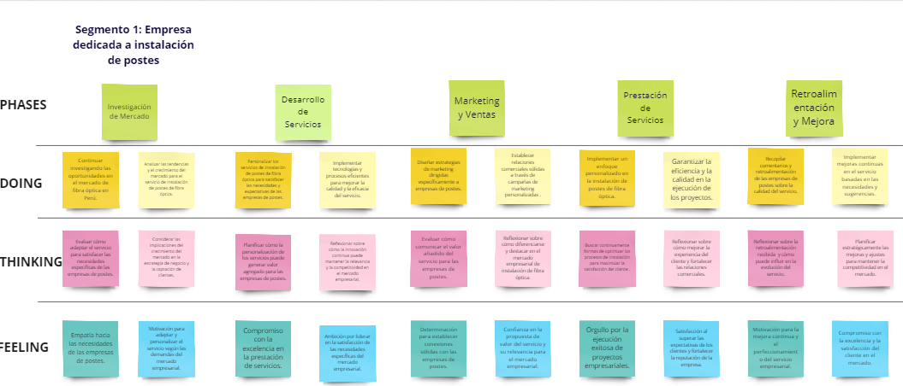
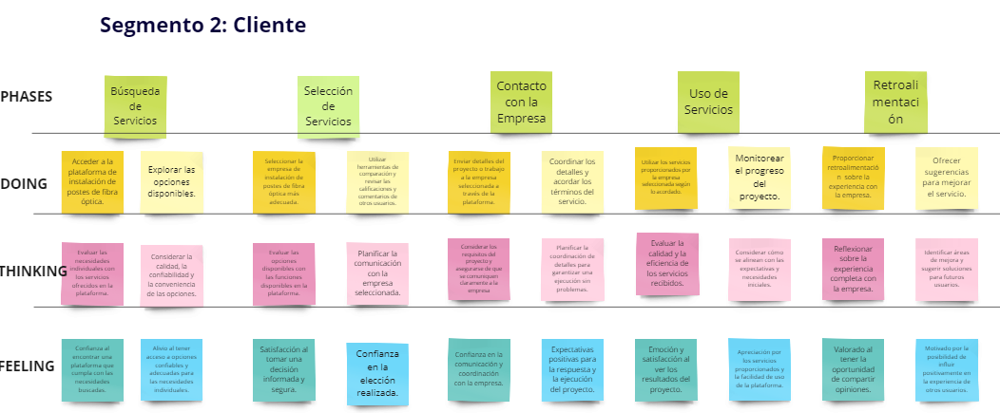
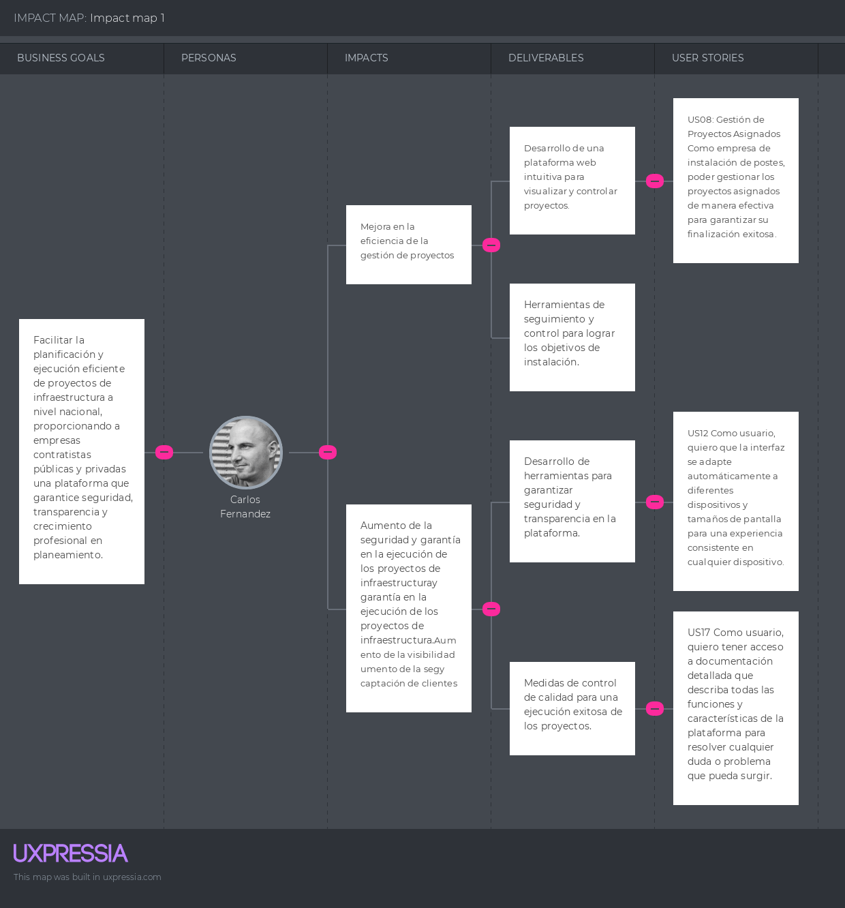
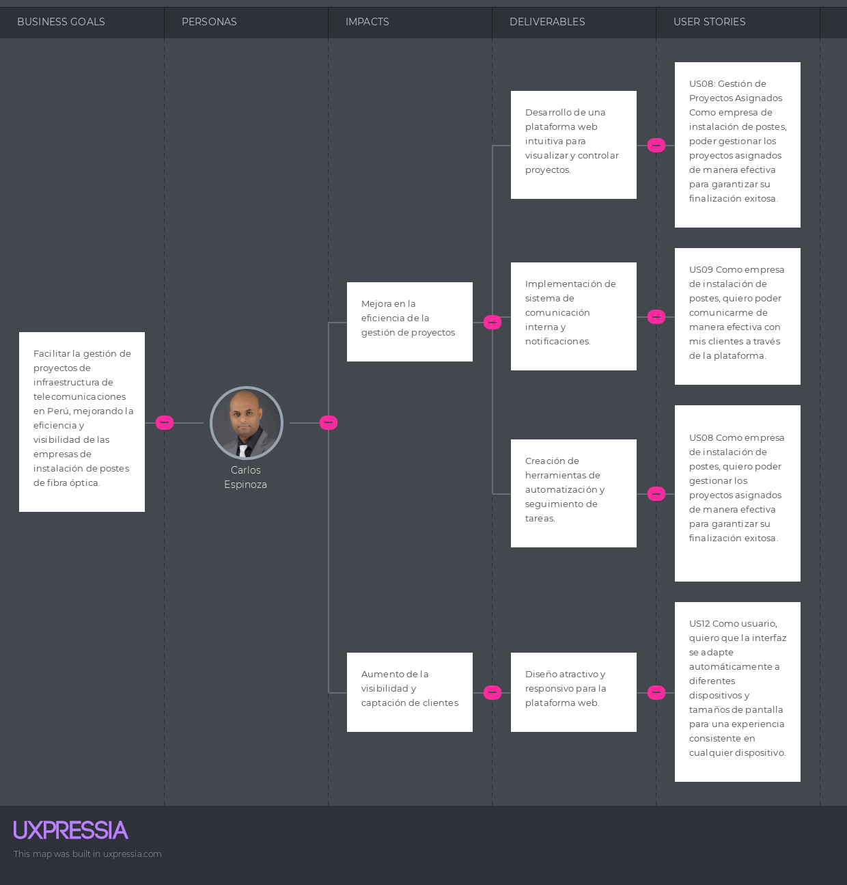

Universidad Peruana de Ciencias Aplicadas

Carrera: Ingeniería de Software

Ciclo: 2024-01

Curso: Aplicaciones Web

Sección: WX56

Profesor: Alex Humberto Sánchez Ponce

Informe del Trabajo Final

Startup: InnovaTec

Producto: EasyPost

Integrantes:
- 
- 
- 
- Chavez Guerrero, Luis Sebastian - U202216444
- Ybañez Esquerre, Miguel Angel - U20201B298
- 

Junio del 2024

---
# Registro de Versiones del Informe

---
# Project Report Collaboration Insights

---
# Student Outcome
El curso contribuye al cumplimiento del Student Outcome ABET: **ABET – EAC - Student Outcome 3**   Criterio: *Capacidad de comunicarse efectivamente con un rango de audiencias.*

En el siguiente cuadro se describe las acciones realizadas y enunciados de conclusiones por parte del grupo, que permiten sustentar el haber alcanzado el logro del ABET – EAC - Student Outcome 3.

| Criterio específico | Acciones realizadas | Conclusiones |
| - | - | - |
| Comunica oralmente sus ideas y/o resultados con objetividad a público de diferentes especialidades y niveles jerarquicos, en el marco del desarrollo de un proyecto en ingeniería. | **Apellido Apellido Nombre Nombre**   ***TB1:*** Morbi vel tortor id eros dictum venenatis id ut dui.Mauris quis tellus sed nunc hendrerit vehicula ac id mauris.   ***TP:*** Morbi vel tortor id eros dictum venenatis id ut dui.Mauris quis tellus sed nunc hendrerit vehicula ac id mauris.   ***TB2:*** Morbi vel tortor id eros dictum venenatis id ut dui.Mauris quis tellus sed nunc hendrerit vehicula ac id mauris.   ***TF:*** Morbi vel tortor id eros dictum venenatis id ut dui.Mauris quis tellus sed nunc hendrerit vehicula ac id mauris.    **Apellido Apellido Nombre Nombre**   ***TB1:*** Morbi vel tortor id eros dictum venenatis id ut dui.Mauris quis tellus sed nunc hendrerit vehicula ac id mauris.   ***TP:*** Morbi vel tortor id eros dictum venenatis id ut dui.Mauris quis tellus sed nunc hendrerit vehicula ac id mauris.   ***TB2:*** Morbi vel tortor id eros dictum venenatis id ut dui.Mauris quis tellus sed nunc hendrerit vehicula ac id mauris.   ***TF:*** Morbi vel tortor id eros dictum venenatis id ut dui.Mauris quis tellus sed nunc hendrerit vehicula ac id mauris.    | ***TB1:*** Fusce cursus dolor et nulla suscipit, sit amet ullamcorper nibh vestibulum.    ***TP:*** Fusce cursus dolor et nulla suscipit, sit amet ullamcorper nibh vestibulum.    ***TB2:*** Fusce cursus dolor et nulla suscipit, sit amet ullamcorper nibh vestibulum.    ***TF:*** Fusce cursus dolor et nulla suscipit, sit amet ullamcorper nibh vestibulum. | 
| Comunica en forma escrita ideas y/o resultados con objetividad a público de diferentes especialidades y niveles jerarquicos, en el marco del desarrollo de un proyecto en ingeniería. | ***Apellido Apellido Nombre Nombre***   ***TB1:*** Cras sed diam suscipit, malesuada ex rutrum, fringilla orci. Vestibulum in nunc quis elit suscipit sollicitudin.   ***TP:*** Cras sed diam suscipit, malesuada ex rutrum, fringilla orci. Vestibulum in nunc quis elit suscipit sollicitudin.   ***TB2:*** Cras sed diam suscipit, malesuada ex rutrum, fringilla orci. Vestibulum in nunc quis elit suscipit sollicitudin.   ***TF:*** Cras sed diam suscipit, malesuada ex rutrum, fringilla orci. Vestibulum in nunc quis elit suscipit sollicitudin.    ***Apellido Apellido Nombre Nombre***   ***TB1:*** Cras sed diam suscipit, malesuada ex rutrum, fringilla orci. Vestibulum in nunc quis elit suscipit sollicitudin.   ***TP:*** Cras sed diam suscipit, malesuada ex rutrum, fringilla orci. Vestibulum in nunc quis elit suscipit sollicitudin.   ***TB2:*** Cras sed diam suscipit, malesuada ex rutrum, fringilla orci. Vestibulum in nunc quis elit suscipit sollicitudin.   ***TF:*** Cras sed diam suscipit, malesuada ex rutrum, fringilla orci. Vestibulum in nunc quis elit suscipit sollicitudin. | ***TB1:*** FEtiam imperdiet quam condimentum velit tempor porttitor.    ***TP:*** FEtiam imperdiet quam condimentum velit tempor porttitor.    ***TB2:*** FEtiam imperdiet quam condimentum velit tempor porttitor.    ***TF:*** FEtiam imperdiet quam condimentum velit tempor porttitor. |

---
# Contenido 
## Tabla de contenidos

### [Capítulo I: Introducción](#capítulo-i-introducción)
- [1.1. Startup Profile](#11-startup-profile)
    - [1.1.1 Descripción de la Startup](#111-descripción-de-la-startup)
    - [1.1.2 Perfiles de integrantes del equipo](#112-perfiles-de-integrantes-del-equipo)
- [1.2 Solution Profile](#12-solution-profile)
    - [1.2.1 Antecedentes y problemática](#121-antecedentes-y-problemática)
    - [1.2.2 Lean UX Process](#122-lean-ux-process)
        - [1.2.2.1. Lean UX Problem Statements](#1221-lean-ux-problem-statements)
        - [1.2.2.2. Lean UX Assumptions](#1222-lean-ux-assumptions)
        - [1.2.2.3. Lean UX Hypothesis Statements](#1223-lean-ux-hypothesis-statements)
        - [1.2.2.4. Lean UX Canvas](#1224-lean-ux-canvas)
- [1.3. Segmentos objetivo](#13-segmentos-objetivo)

### [Capítulo II: Requirements Elicitation & Analysis](#capítulo-ii-requirements-elicitation--analysis)
- [2.1. Competidores](#21-competidores)
    - [2.1.1. Análisis competitivo](#211-análisis-competitivo)
    - [2.1.2. Estrategias y tácticas frente a competidores](#212-estrategias-y-tácticas-frente-a-competidores)
- [2.2. Entrevistas](#22-entrevistas)
    - [2.2.1. Diseño de entrevistas](#221-diseño-de-entrevistas)
    - [2.2.2. Registro de entrevistas](#222-registro-de-entrevistas)
    - [2.2.3. Análisis de entrevistas](#223-análisis-de-entrevistas)
- [2.3. Needfinding](#23-needfinding)
    - [2.3.1. User Personas](#231-user-personas)
    - [2.3.2. User Task Matrix](#232-user-task-matrix)
    - [2.3.3. User Journey Mapping](#233-user-journey-mapping)
    - [2.3.4. Empathy Mapping](#234-empathy-mapping)
    - [2.3.5. As-is Scenario Mapping](#235-as-is-scenario-mapping)
- [2.4. Ubiquitous Language](#24-ubiquitous-language)

### [Capítulo III: Requirements Specification](#capítulo-iii-requirements-specification)
- [3.1. To-Be Scenario Mapping](#31-to-be-scenario-mapping)
- [3.2. User Stories](#32-user-stories)
- [3.3. Impact Mapping](#33-impact-mapping)
- [3.4. Product Backlog](#34-product-backlog)

### [Capítulo IV: Product Design](#capítulo-iv-product-design)
- [4.1. Style Guidelines](#41-style-guidelines)
    - [4.1.1. General Style Guidelines](#411-general-style-guidelines)
    - [4.1.2. Web Style Guidelines](#412-web-style-guidelines)
- [4.2. Information Architecture](#42-information-architecture)  
    - [4.2.1. Organization Systems](#421-organization-systems)
    - [4.2.2. Labeling Systems](#422-labeling-systems)
    - [4.2.3. SEO Tags and Meta Tags](#423-seo-tags-and-meta-tags)
    - [4.2.4. Searching Systems](#424-searching-systems)
    - [4.2.5. Navigation Systems](#425-navigation-systems)
- [4.3. Landing Page UI Design](#43-landing-page-ui-design)
    - [4.3.1. Landing Page Wireframe](#431-landing-page-wireframe)
    - [4.3.2. Landing Page Mock-up](#432-landing-page-mock-up)
- [4.4. Web Applications UX/UI Design](#44-web-applications-uxui-design)
    - [4.4.1. Web Applications Wireframes](#441-web-applications-wireframes)
    - [4.4.2. Web Applications Wireflow Diagrams](#442-web-applications-wireflow-diagrams)
    - [4.4.3. Web Applications Mock-ups](#443-web-applications-mock-ups)
    - [4.4.4. Web Applications User Flow Diagrams](#444-web-applications-user-flow-diagrams)
- [4.5. Web Applications Prototyping](#45-web-applications-prototyping)
- [4.6. Domain-Driven Software Architecture](#46-domain-driven-software-architecture)
    - [4.6.1. Software Architecture Context Diagram](#461-software-architecture-context-diagram)
    - [4.6.2. Software Architecture Container Diagrams](#462-software-architecture-container-diagrams)
    - [4.6.3. Software Architecture Components Diagrams](#463-software-architecture-components-diagrams)
- [4.7. Software Object-Oriented Design](#47-software-object-oriented-design)
    - [4.7.1. Class Diagrams](#471-class-diagrams)
    - [4.7.2. Class Dictionary](#472-class-dictionary)
- [4.8. Database Design](#48-database-design)
    - [4.8.1. Database Diagram](#481-database-diagram)

### [Capítulo V: Product Implementation, Validation & Deployment](#capítulo-v-product-implementation-validation--deployment)
- [5.1. Software Configuration Management](#51-software-configuration-management)
    - [5.1.1. Software Development Environment Configuration](#511-software-development-environment-configuration)
    - [5.1.2. Source Code Management](#512-source-code-management)
    - [5.1.3. Source Code Style Guide & Conventions](#513-source-code-style-guide--conventions)
    - [5.1.4. Software Deployment Configuration](#514-software-deployment-configuration)
- [5.2. Landing Page, Services & Applications Implementation](#52-landing-page-services--applications-implementation)
    - [5.2.1. Sprint 1](#521-sprint-1)
        - [5.2.1.1. Sprint Planning 1](#5211-sprint-planning-1)
        - [5.2.1.2. Sprint Backlog 1](#5212-sprint-backlog-1)
        - [5.2.1.3. Development Evidence for Sprint Review](#5213-development-evidence-for-sprint-review)
        - [5.2.1.4. Testing Suite Evidence for Sprint Review](#5214-testing-suite-evidence-for-sprint-review)
        - [5.2.1.5. Execution Evidence for Sprint Review](#5215-execution-evidence-for-sprint-review)
        - [5.2.1.6. Services Documentation Evidence for Sprint Review](#5216-services-documentation-evidence-for-sprint-review)
        - [5.2.1.7. Software Deployment Evidence for Sprint Review](#5217-software-deployment-evidence-for-sprint-review)
        - [5.2.1.8. Team Collaboration Insights during Sprint](#5218-team-collaboration-insights-during-sprint)
    - [5.2.2. Sprint 2](#522-sprint-2)
        - [5.2.2.1. Sprint Planning 2](#5221-sprint-planning-2)
        - [5.2.2.2. Sprint Backlog 2]()
        - [5.2.2.3. Development Evidence for Sprint Review]()
        - [5.2.2.4. Testing Suite Evidence for Sprint Review]()
        - [5.2.2.5. Execution Evidence for Sprint Review]()
        - [5.2.2.6. Services Documentation Evidence for Sprint Review]()
        - [5.2.2.7. Software Deployment Evidence for Sprint Review]()
        - [5.2.2.8. Team Collaboration Insights during Sprint]()
    - [5.2.3. Sprint 3]()
        - [5.2.3.1. Sprint Planning 3]()
        - [5.2.3.2. Sprint Backlog 3]()
        - [5.2.3.3. Development Evidence for Sprint Review]()
        - [5.2.3.4. Testing Suite Evidence for Sprint Review]()
        - [5.2.3.5. Execution Evidence for Sprint Review]()
        - [5.2.3.6. Services Documentation Evidence for Sprint Review]()
        - [5.2.3.7. Software Deployment Evidence for Sprint Review]()
        - [5.2.3.8. Team Collaboration Insights during Sprint]()
    - [5.2.4. Sprint 4]()
        - [5.2.4.1. Sprint Planning 4]()
        - [5.2.4.2. Sprint Backlog 4]()
        - [5.2.4.3. Development Evidence for Sprint Review]()
        - [5.2.4.4. Testing Suite Evidence for Sprint Review]()
        - [5.2.4.5. Execution Evidence for Sprint Review]()
        - [5.2.4.6. Services Documentation Evidence for Sprint Review]()
        - [5.2.4.7. Software Deployment Evidence for Sprint Review]()
        - [5.2.4.8. Team Collaboration Insights during Sprint]()
- [5.3. Validation Interviews]()
    - [5.3.1. Diseño de Entrevistas]()
    - [5.3.2. Registro de Entrevistas]()
    - [5.3.3. Evaluaciones según heurísticas]()
- [5.4. Video About-the-Product]()

---
# Capítulo I: Introducción
## 1.1. Startup Profile
### 1.1.1 Descripción de la Startup
### 1.1.2 Perfiles de integrantes del equipo
## 1.2 Solution Profile
### 1.2.1 Antecedentes y problemática
### 1.2.2 Lean UX Process
#### 1.2.2.1. Lean UX Problem Statements
#### 1.2.2.2. Lean UX Assumptions
#### 1.2.2.3. Lean UX Hypothesis Statements
#### 1.2.2.4. Lean UX Canvas
## 1.3. Segmentos objetivo
# Capítulo II: Requirements Elicitation & Analysis
## 2.1 Competidores
## 2.2. Entrevistas
### 2.2.1. Diseño de entrevistas
### 2.2.2. Registro de entrevistas
### 2.2.3. Análisis de entrevistas
## 2.3. Needfinding
### 2.3.1. User Personas
### 2.3.2. User Task Matrix
### 2.3.3. User Journey Mapping
### 2.3.4. Empathy Mapping
### 2.3.5. As-is Scenario Mapping
## 2.4. Ubiquitous Language
# Capítulo III: Requirements Specification
## 3.1. To-Be Scenario Mapping

En el capitulo, nos enfocaremos en nuestras metas para enriquecer la experiencia tanto de las compañías que ofrecen servicios como de los usuarios finales en nuestra plataforma de instalación de postes de fibra óptica.  Desde la búsqueda inicial hasta la retroalimentación final, analizaremos cómo deseamos simplificar y mejorar cada fase del proceso para ambas partes involucradas. Con una atención especial en el usuario, nuestro objetivo es asegurar una experiencia más fluida y gratificante para todos los usuarios de nuestra plataforma.

 

 
Enlace al To-Be Scenario Mapping: https://miro.com/app/board/uXjVKWk-mNo=/?share_link_id=26893800110
 

## 3.2. User Stories
<table>
  <tr>
    <th>Epic ID</th>
    <th>Título</th>
    <th>Descripción</th>
  </tr>
  <tr>
    <td>E01</td>
    <td>Creación y Gestión de Cuentas de Usuario</td>
    <td>Desarrollar la funcionalidad de registro, inicio de sesión y gestión de cuentas de usuario.</td>
  </tr>
  <tr>
    <td>E02</td>
    <td>Búsqueda y Filtrado de Empresas de Postes.</td>
    <td>Implementar la funcionalidad de búsqueda y filtrado para permitir a las empresas de telecomunicaciones encontrar empresas de instalación de postes según sus necesidades.</td>
  </tr>
  <tr>
    <td>E03</td>
    <td>Gestión de Proyectos de Instalación de Postes.</td>
    <td>Desarrollar la funcionalidad para que las empresas de instalación de postes gestionen sus proyectos de manera efectiva desde la plataforma.</td>
  </tr>
  <tr>
    <td>E04</td>
    <td>Funcionalidades Avanzadas de Interacción</td>
    <td>Desarrollar funcionalidades avanzadas para mejorar la interacción entre las empresas de telecomunicaciones y las empresas de instalación de postes.</td>
  </tr>
  <tr>
    <td>E05</td>
    <td>Mejora de la Experiencia del Usuario</td>
    <td>Mejorar la experiencia del usuario en la plataforma para garantizar una navegación intuitiva y una interacción fluida.</td>
  </tr>
  <tr>
    <td>E06</td>
    <td>Seguridad y Privacidad de Datos</td>
    <td>Garantizar la seguridad y privacidad de los datos de los usuarios en la plataforma para cumplir con los estándares de protección de datos.</td>
  </tr>
  <tr>
    <td>E07</td>
    <td>Soporte al Usuario</td>
    <td>Proporcionar capacitación y soporte efectivos a los usuarios para garantizar que puedan aprovechar al máximo todas las funcionalidades de la plataforma.</td>
  </tr>
  </tr>
  <tr>
    <td>E08</td>
    <td>Integración con Plataformas de Pago</td>
    <td>Integrar la plataforma con sistemas de pago para facilitar la facturación y el procesamiento de transacciones para suscripciones y servicios adicionales.</td>
  </tr>
  <tr>
    <td>E09</td>
    <td>Mejoras en la Presentación y Experiencias del Usuario</td>
    <td>Mejoras relacionadas con la presentación visual, el diseño, el contenido y la experiencia del usuario tanto en la landing page como en todas las páginas estáticas del sitio web.</td>
  </tr>
</table>

<table >
  <tr>
    <th>Story ID</th>
    <th>Título</th>
    <th>Descripción</th>
    <th>Criterios de Aceptación</th>
    <th>Relacionados con Epic (Epic ID)</th>
  </tr>
  <tr>
    <td>US01</td>
    <td>Registro de nuevo usuario</td>
    <td>Como visitante al sitio web, quiero poder registrarme como usuario para acceder a las funciones de la plataforma.</td>
    <td>Escenario 1:
Dado que el usuario accede al formulario de registro.
Cuando haga clic en el botón de registro desde la página de inicio.
Entonces se muestra un formulario de registro con campos para ingresar la información requerida.

Escenario 2:
Dado que el usuario completa todos los campos del formulario de registro.
Cuando envía la solicitud de registro.
Entonces se crea una nueva cuenta de usuario y se redirige al usuario a la página de inicio de sesión.

Escenario 3:
Dado que el usuario intenta registrarse con un correo electrónico que ya está en uso.
Cuando envía la solicitud de registro.
Entonces se muestra un mensaje de error indicando que el correo electrónico ya está registrado y se le sugiere iniciar sesión en su lugar.
</td>
    <td>E01</td>
  </tr>
   <tr>
    <td>US02</td>
    <td>Inicio de sesión de usuario</td>
    <td>Como usuario registrado, quiero poder iniciar sesión en mi cuenta para acceder a las funciones.</td>
    <td>Escenario 1:
Dado que el usuario accede al formulario de inicio de sesión.
Cuando haga clic en el enlace de inicio de sesión desde la página de inicio.
Entonces se muestra un formulario de inicio de sesión con campos para ingresar correo electrónico y contraseña.

Escenario 2:
Dado que el usuario ingresa las credenciales correctas.
Cuando envía la solicitud de inicio de sesión.
Entonces se autentica al usuario y se le redirige al panel de control de su cuenta.

Escenario 3:
Dado que el usuario olvida su contraseña.
Cuando haga clic en el enlace de recuperación de contraseña.
Entonces se le redirige a una página donde puede restablecer su contraseña mediante un correo electrónico de restablecimiento.
</td>
    <td>E01</td>
  </tr>
      <td>US03</td>
    <td>Gestión de Perfil de Usuario</td>
    <td>Como usuario registrado, quiero poder editar mi perfil y actualizar mi información personal.</td>
    <td>Escenario 1:
Dado que el usuario accede a la página de configuración de perfil.
Cuando desde el panel de control, hace clic en la opción de editar perfil.
Entonces se muestra un formulario rellenado con la información actual del usuario.

Escenario 2:
Dado que el usuario realiza cambios en su perfil.
Cuando edita y guarda los cambios.
Entonces la información del perfil se actualiza correctamente en la base de datos.

Escenario 3:
Dado que el usuario desea cambiar su contraseña.
Cuando accede a la página de configuración de contraseña.
Entonces se le permite cambiar su contraseña, y la nueva contraseña se almacena de forma segura en la base de datos.
</td>
    <td>E01</td>
  </tr>
    </tr>
      <td>US04</td>
    <td>Búsqueda por ubicación</td>
    <td>Como usuario, quiero poder buscar empresas de instalación de postes por ubicación para encontrar opciones cercanas a una área específica.</td>
    <td>Escenario 1:
Dado que el usuario accede a la página de búsqueda.
Cuando desde el panel de control, selecciona la opción de búsqueda por ubicación.
Entonces se muestra un mapa interactivo donde el usuario puede ingresar una ubicación o hacer clic en un punto en el mapa.

Escenario 2:
Dado que el usuario ingresa una ubicación específica.
Cuando completa el campo de búsqueda con una dirección o coordenadas.
Entonces se muestran las empresas de instalación de postes cercanas a esa ubicación, ordenadas por distancia.

Escenario 3:
Dado que el usuario hace clic en una empresa de postes en el mapa.
Cuando selecciona un marcador en el mapa.
Entonces se muestra información detallada sobre esa empresa de instalación de postes, como su nombre, dirección y servicios ofrecidos.
</td>
    <td>E02</td>
  </tr>
    </tr>
      <td>US05</td>
    <td>Filtrado por servicios ofrecidos</td>
    <td>Como usuario, quiero poder filtrar las empresas de instalación de postes por los servicios específicos que ofrecen.</td>
    <td>Escenario 1:
Dado que el usuario accede a la página de búsqueda.
Cuando desde el panel de control, selecciona la opción de filtrar por servicios.
Entonces se muestran opciones de filtro que incluyen diferentes servicios relacionados con la instalación de postes de fibra óptica.

Escenario 2:
Dado que el usuario selecciona un servicio específico.
Cuando marca la casilla correspondiente en el menú de filtrado.
Entonces se muestran solo las empresas de instalación de postes que ofrecen ese servicio en particular.

Escenario 3:
Dado que el usuario selecciona múltiples servicios para filtrar.
Cuando marca varias casillas de servicios en el menú de filtrado.
Entonces se muestran las empresas de instalación de postes que ofrecen todos los servicios seleccionados, cumpliendo con todos los criterios de filtro.
</td>
    <td>E02</td>
  </tr>
    </tr>
      <td>US06</td>
    <td>Visualización de resultados de búsqueda</td>
    <td>Como usuario, quiero poder ver los resultados de mi búsqueda de manera clara y ordenada.</td>
    <td>Escenario 1:
Dado que el usuario realiza una búsqueda.
Cuando ingresa sus criterios de búsqueda y envía la solicitud.
Entonces se muestran los resultados de manera clara, con información relevante como el nombre de la empresa y su ubicación.

Escenario 2:
Dado que la búsqueda no arroja resultados.
Cuando el usuario ingresa criterios de búsqueda que no coinciden con ninguna empresa de instalación de postes.
Entonces se muestra un mensaje indicando que no se encontraron resultados coincidentes y se le sugiere al usuario que intente con diferentes criterios de búsqueda.

Escenario 3:
Dado que el usuario desea ver más detalles sobre una empresa de postes.
Cuando se hace clic en el nombre de una empresa en los resultados de búsqueda.
Entonces se muestra una ventana emergente o una página nueva con información detallada sobre esa empresa.
</td>
    <td>E02</td>
  </tr>
  </tr>
    </tr>
      <td>US07</td>
    <td>Recepción de Solicitudes de Cotización</td>
    <td>Como empresa de instalación de postes, quiero recibir solicitudes de cotización de las empresas de telecomunicaciones interesadas en mis servicios.</td>
    <td>Escenario 1:
Dado que la empresa de telecomunicaciones selecciona la opción de solicitar cotización.
Cuando completa un formulario con detalles sobre el proyecto.
Entonces se genera automáticamente una solicitud de cotización y se envía a la empresa de instalación de postes seleccionada.

Escenario 2:
Dado que la empresa de instalación de postes recibe una solicitud de cotización.
Cuando accede a su panel de control.
Entonces se muestra la solicitud con todos los detalles proporcionados por la empresa de telecomunicaciones.

Escenario 3:
Dado que la empresa de instalación de postes desea responder a la solicitud.
Cuando revisa los detalles del proyecto y determina un precio.
Entonces envía una cotización detallada a la empresa de telecomunicaciones a través de la plataforma.
</td>
    <td>E03</td>
  </tr>
    </tr>
      <td>US08</td>
    <td>Gestión de Proyectos Asignados</td>
    <td>Como empresa de instalación de postes, quiero poder gestionar los proyectos asignados de manera efectiva para garantizar su finalización exitosa.</td>
    <td>Escenario 1:
Dado que la empresa de instalación de postes recibe una solicitud de proyecto.
Cuando se acepta una solicitud de cotización y se convierte en un proyecto asignado.
Entonces el proyecto se añade automáticamente a la lista de proyectos activos en el panel de control de la empresa.

Escenario 2:
Dado que la empresa de instalación de postes desea asignar recursos al proyecto.
Cuando accede a los detalles del proyecto.
Entonces puede asignar empleados, materiales y equipos necesarios para completar el proyecto.

Escenario 3:
Dado que la empresa de instalación de postes actualiza el estado del proyecto.
Cuando hay avances significativos en el proyecto.
Entonces actualiza el estado del proyecto en la plataforma, indicando si está en progreso, completado o pendiente de aprobación.
</td>
    <td>E03</td>
  </tr>
   </tr>
      <td>US09</td>
    <td>Comunicación con los clientes</td>
    <td>Como empresa de instalación de postes, quiero poder comunicarme de manera efectiva con mis clientes a través de la plataforma.</td>
    <td>Escenario 1:
Dado que el cliente solicita actualizaciones sobre el proyecto.
Cuando accede al panel de control y envía un mensaje a la empresa de instalación de postes.
Entonces la empresa recibe la solicitud de información y puede responder directamente desde la plataforma.

Escenario 2:
Dado que la empresa de instalación de postes desea enviar actualizaciones periódicas.
Cuando hay cambios importantes en el proyecto.
Entonces puede enviar notificaciones automáticas o mensajes personalizados a los clientes para mantenerlos informados sobre el progreso del proyecto.

Escenario 3:
Dado que el cliente tiene una queja o consulta.
Cuando envía un mensaje a través de la plataforma.
Entonces la empresa de instalación de postes recibe la notificación y puede responder de manera oportuna para resolver el problema o responder a la consulta.
</td>
    <td>E03</td>
    </tr>
      <td>US10</td>
    <td>Calificación y Comentarios sobre Empresas</td>
    <td>Como usuario, quiero poder calificar y dejar comentarios sobre las empresas de instalación de postes con las que he trabajado para ayudar a otros usuarios en sus decisiones.</td>
    <td>Escenario 1:
Dado que el usuario accede a la página de perfil de una empresa.
Cuando desde los resultados de búsqueda o la lista de proyectos, hace clic en el nombre de una empresa.
Entonces se muestra la información detallada de la empresa, incluida su calificación actual y los comentarios de otros usuarios.

Escenario 2:
Dado que el usuario desea dejar una calificación.
Cuando accede a la página de perfil de una empresa.
Entonces puede seleccionar una calificación de estrellas y escribir un comentario opcional sobre su experiencia con la empresa.

Escenario 3:
Dado que el usuario visualiza las calificaciones y comentarios de otras personas.
Cuando busca empresas de instalación de postes o revisa su historial de proyectos.
Entonces puede ver las calificaciones promedio y los comentarios de otros usuarios sobre cada empresa.
</td>
    <td>E04</td>
  </tr>
    </tr>
      <td>US11</td>
    <td>Notificaciones Personalizadas</td>
    <td>Como usuario, quiero recibir notificaciones personalizadas sobre actualizaciones relevantes y eventos importantes.</td>
    <td>Escenario 1:
Dado que el usuario accede a la página de configuración de notificaciones.
Cuando desde su perfil, accede a la configuración de notificaciones.
Entonces puede seleccionar qué tipos de notificaciones desea recibir.

Escenario 2:
Dado que el usuario recibe una notificación.
Cuando ocurre un evento relevante según la configuración del usuario.
Entonces recibe una notificación instantánea en la plataforma y/o un correo electrónico, según sus preferencias.

Escenario 3:
Dado que el usuario desea desactivar ciertas notificaciones.
Cuando cambia su configuración de notificaciones.
Entonces puede desactivar notificaciones específicas.
</td>
    <td>E04</td>
  </tr>
    </tr>
      <td>US12</td>
    <td>Diseño Responsivo</td>
    <td>Como usuario, quiero que la interfaz se adapte automáticamente a diferentes dispositivos y tamaños de pantalla para una experiencia consistente en cualquier dispositivo.</td>
    <td>Escenario 1:
Dado que el usuario accede a la plataforma desde un dispositivo móvil.
Cuando carga la página de inicio o cualquier otra página dentro de la plataforma.
Entonces todos los elementos de la interfaz se reorganizan y ajustan para adaptarse a la pantalla más pequeña, manteniendo la usabilidad y la legibilidad.

Escenario 2:
Dado que el usuario accede a la plataforma desde una tableta.
Cuando navega por diferentes secciones y funciones de la plataforma.
Entonces la interfaz se ajusta automáticamente para aprovechar el espacio disponible en la pantalla, proporcionando una experiencia de usuario cómoda y funcional.

Escenario 3:
Dado que el usuario accede a la plataforma desde un ordenador de escritorio.
Cuando utiliza la plataforma en una pantalla grande.
Entonces la interfaz se expande para aprovechar al máximo el espacio disponible.
</td>
    <td>E05</td>
  </tr>
    </tr>
      <td>US13</td>
    <td>Mejora de la navegación</td>
    <td>Como usuario, quiero una navegación clara y consistente para poder encontrar rápidamente la información que necesito.</td>
    <td>Escenario 1:
Dado que el usuario accede a la plataforma desde cualquier dispositivo y conexión a internet.
Cuando carga cualquier página dentro de la plataforma.
Entonces la página se carga completamente en menos de 3 segundos, proporcionando una experiencia de usuario fluida y sin esperas.

Escenario 2:
Dado que el usuario accede a la plataforma en momentos de alta demanda.
Cuando navega por la plataforma durante horas pico o períodos de carga elevada.
Entonces la velocidad de carga de las páginas se mantiene constante y no se ven afectadas por la carga del servidor.

Escenario 3:
Dado que el usuario accede a la plataforma desde una conexión de datos móviles.
Cuando utiliza la plataforma en un entorno con conexión a internet móvil.
Entonces las páginas se cargan rápidamente incluso en conexiones más lentas, gracias a la optimización de imágenes y recursos.
</td>
    <td>E05</td>
  </tr>
    </tr>
      <td>US14</td>
    <td>Optimización de la velocidad de carga</td>
    <td>Como usuario, quiero que las páginas carguen rápidamente para poder acceder a la información y funciones sin demoras.</td>
    <td>Escenario 1:
Dado que el usuario accede a la plataforma desde cualquier página.
Cuando busca un menú de navegación.
Entonces encuentra un menú claramente visible y fácil de usar que le permite acceder a todas las secciones principales de la plataforma.

Escenario 2:
Dado que el usuario desea volver a la página de inicio.
Cuando navega por diferentes secciones de la plataforma.
Entonces encuentra un enlace de "Inicio" o un botón de logo que le permite volver a la página de inicio en cualquier momento.

Escenario 3:
Dado que el usuario desea acceder a funciones específicas desde cualquier página.
Cuando necesita acceder a su perfil, configuración o funciones principales de la plataforma.
Entonces encuentra enlaces o botones consistentes en todas las páginas que le permiten acceder a estas funciones de manera rápida y directa.
</td>
    <td>E05</td>
  </tr>
    </tr>
      <td>US15</td>
    <td>Implementación de HTTPS</td>
    <td>Como Developer, quiero asegurarme de que todas las comunicaciones entre el navegador del usuario y el servidor estén cifradas mediante HTTPS para proteger la privacidad de los datos.</td>
    <td>Escenario 1:
Dado que el usuario accede a la plataforma a través de un navegador web.
Cuando carga cualquier página dentro de la plataforma.
Entonces la conexión se realiza a través de HTTPS, lo que se indica mediante el icono de un candado en la barra de direcciones del navegador.

Escenario 2:
Dado que el usuario envía datos sensibles a través de formularios en la plataforma.
Cuando completa campos de datos personales o confidenciales.
Entonces los datos se transmiten de manera segura a través de una conexión cifrada HTTPS para protegerlos contra accesos no autorizados.

Escenario 3:
Dado que se accede a la plataforma desde dispositivos móviles o conexiones públicas.
Cuando el usuario utiliza la plataforma en entornos potencialmente menos seguros.
Entonces la conexión HTTPS garantiza la privacidad de los datos incluso en redes Wi-Fi públicas o conexiones móviles.
</td>
    <td>E06</td>
  </tr>
    </tr>
      <td>US16</td>
    <td>Política y Gestión de Contraseñas</td>
    <td>Como usuario, quiero que se apliquen políticas de gestión de contraseñas para garantizar la seguridad de mi cuenta.</td>
    <td>Escenario 1:
Dado que el usuario crea una nueva contraseña.
Cuando se registra como nuevo usuario o cambia su contraseña existente.
Entonces la plataforma exige una contraseña que cumpla con requisitos mínimos de complejidad, como longitud y caracteres especiales.

Escenario 2:
Dado que el usuario olvida su contraseña.
Cuando intenta restablecer su contraseña utilizando la opción de recuperación de contraseña.
Entonces recibe un enlace de restablecimiento de contraseña seguro y de un solo uso para evitar accesos no autorizados.

Escenario 3:
Dado que el usuario intenta ingresar múltiples contraseñas incorrectas.
Cuando se detectan intentos repetidos de acceso no autorizado.
Entonces la cuenta se bloquea temporalmente y se le solicita al usuario que siga un proceso de verificación adicional para desbloquearla.
</td>
    <td>E06</td>
  </tr>
    </tr>
      <td>US17</td>
    <td>Desarrollo de documentación detallada</td>
    <td>Como usuario, quiero tener acceso a documentación detallada que describa todas las funciones y características de la plataforma para resolver cualquier duda o problema que pueda surgir.</td>
    <td>Escenario 1:
Dado que el usuario accede al centro de ayuda o documentación.
Cuando desde la plataforma, encuentra un enlace a la documentación de ayuda.
Entonces se le redirige a una página que contiene una descripción general de la plataforma y enlaces a recursos adicionales.

Escenario 2:
Dado que el usuario busca información sobre una función específica.
Cuando utiliza la función de búsqueda dentro de la documentación.
Entonces encuentra resultados relevantes que describen cómo utilizar esa función y los pasos a seguir.

Escenario 3:
Dado que el usuario tiene una pregunta específica que no se encuentra en la documentación.
Cuando contacta al equipo de soporte a través de la plataforma.
Entonces recibe una respuesta rápida y detallada del equipo de soporte para resolver su pregunta o problema.
</td>
    <td>E06</td>
  </tr>
    </tr>
      <td>US18</td>
    <td>Creación de Foro de usuarios</td>
    <td>Como usuario de la plataforma, quiero tener acceso a un foro de usuarios donde pueda hacer preguntas, intercambiar ideas y compartir experiencias con otros usuarios.</td>
    <td>Escenario 1:
Dado que el usuario accede al foro de usuarios desde la plataforma.
Cuando encuentra un enlace o botón dedicado al foro en la interfaz.
Entonces se le redirige a una sección donde puede ver las discusiones más recientes y participar en ellas.

Escenario 2:
Dado que el usuario tiene una pregunta o problema.
Cuando publica una nueva pregunta o tema en el foro.
Entonces recibe respuestas y comentarios de otros usuarios de la comunidad, así como del equipo de soporte si es necesario.

Escenario 3:
Dado que el usuario desea buscar discusiones anteriores.
Cuando utiliza la función de búsqueda dentro del foro.
Entonces encuentra hilos de discusión relevantes que abordan su pregunta o problema y puede encontrar soluciones previamente publicadas.
</td>
    <td>E07</td>
  </tr>
    </tr>
      <td>US19</td>
    <td>Integración con Pasarelas de Pago</td>
    <td>Como Developer, quiero integrar la plataforma con pasarelas de pago confiables y seguras para procesar transacciones de suscripción y pagos por servicios adicionales.</td>
    <td>Escenario 1:
Dado que el Developer accede a la configuración de pagos.
Cuando navega a la sección de integración de pasarelas de pago.
Entonces encuentra una lista de opciones de pasarelas de pago compatibles para integrar con la plataforma.

Escenario 2:
Dado que el Developer elige una pasarela de pago.
Cuando selecciona una pasarela de pago y proporciona la información de configuración necesaria, como claves API y credenciales de cuenta.
Entonces la pasarela de pago se integra correctamente con la plataforma y está lista para procesar transacciones.

Escenario 3:
Dado que el usuario realiza un pago de suscripción.
Cuando selecciona un plan de suscripción y completa el proceso de pago.
Entonces el pago se procesa correctamente a través de la pasarela de pago integrada y se actualiza el estado de la suscripción del usuario.
</td>
    <td>E08</td>
  </tr>
    </tr>
      <td>US20</td>
    <td>Gestión de suscripciones</td>
    <td>Como usuario de la plataforma, quiero poder gestionar mi suscripción, ver detalles sobre mi plan actual y realizar cambios si es necesario.</td>
    <td>Escenario 1:
Dado que el usuario accede a la sección de gestión de suscripciones.
Cuando navega a su perfil o a una sección dedicada a las suscripciones.
Entonces encuentra información detallada sobre su plan actual, incluyendo el precio, la fecha de renovación y las características incluidas.

Escenario 2:
Dado que el usuario desea cambiar su plan de suscripción.
Cuando selecciona la opción para cambiar de plan dentro de la plataforma.
Entonces puede seleccionar un nuevo plan de suscripción y completar el proceso de actualización del plan.

Escenario 3:
Dado que el usuario quiere cancelar su suscripción.
Cuando accede a la sección de gestión de suscripciones y selecciona la opción para cancelar su suscripción.
Entonces se le guía a través del proceso de cancelación y su suscripción se cancela correctamente sin complicaciones.
</td>
    <td>E08</td>
  </tr>
    </tr>
      <td>US21</td>
    <td>Implementación de Diseño Responsivo</td>
    <td>Como Developer, quiero implementar un diseño responsivo en el sitio web para garantizar una experiencia de usuario óptima en todos los dispositivos y tamaños de pantalla.</td>
    <td>Escenario 1:
Dado que el desarrollador accede al código fuente del sitio web.
Cuando trabaja en la implementación del diseño responsivo.
Entonces utiliza técnicas de diseño flexible y media queries para garantizar que el sitio web se adapte automáticamente a diferentes dispositivos y resoluciones de pantalla.

Escenario 2:
Dado que el usuario accede al sitio web desde un dispositivo móvil.
Cuando carga la página de inicio o cualquier otra página.
Entonces encuentra que el contenido se reorganiza y ajusta para adaptarse al tamaño de la pantalla, manteniendo la usabilidad y la legibilidad.
</td>
    <td>E09</td>
  </tr>
    </tr>
      <td>US22</td>
    <td>Optimización para SEO</td>
    <td>Como Developer, quiero optimizar el contenido de la landing page y las páginas estáticas para mejorar el posicionamiento en los motores de búsqueda y aumentar la visibilidad en línea.</td>
    <td>Escenario 1:
Dado que el administrador accede al panel de administración del sitio web.
Cuando navega a la sección de configuración de SEO.
Entonces encuentra opciones para ingresar metadatos, palabras clave y descripciones que se utilizarán para optimizar el contenido para SEO.

Escenario 2:
Dado que el visitante busca en línea temas relacionados con la industria.
Cuando realiza una búsqueda en Google utilizando palabras clave relevantes.
Entonces encuentra la landing page y las páginas estáticas del sitio web entre los primeros resultados de búsqueda.
</td>
    <td>E09</td>
  </tr>
    </tr>
      <td>US23</td>
    <td>Diseño atractivo y profesional</td>
    <td>Como visitante del sitio web, quiero encontrar un diseño atractivo y profesional en la landing page y en todas las páginas estáticas para generar confianza en la marca.</td>
    <td>Escenario 1:
Dado que el usuario accede a la landing page.
Cuando carga la página en cualquier dispositivo o navegador.
Entonces encuentra un diseño moderno, limpio y estéticamente agradable que refleja la imagen de la marca de manera positiva.

Escenario 2:
Dado que el usuario navega por las páginas estáticas.
Cuando explora diferentes secciones del sitio web, como la página "Acerca de nosotros" o "Servicios".
Entonces encuentra un diseño coherente y consistente en todas las páginas, con una navegación intuitiva y fácil de usar.
</td>
    <td>E09</td>
  </tr>
    </tr>
      <td>US24</td>
    <td>Llamado a la Acción (Call-to-Action) Efectivo.</td>
    <td>Como visitante del sitio web, quiero encontrar un llamado a la acción efectivo en la landing page que me invite a realizar una acción específica.</td>
    <td>Escenario 1:
Dado que el usuario accede a la página de inicio.
Cuando observa el banner principal de la landing page.
Entonces encuentra una imagen visualmente atractiva que capture su atención y refleje el propósito de la plataforma.

Escenario 2:
Dado que el usuario se desplaza hacia abajo en la landing page.
Cuando llega a la sección de "Características" o "Beneficios".
Entonces encuentra una lista clara y concisa de las características clave o los beneficios ofrecidos por la plataforma, presentados de manera atractiva y fácil de entender.

Escenario 3:
Dado que el usuario llega al final de la landing page.
Cuando encuentre la sección de "Contacto" o "Registro".
Entonces encuentra información clara sobre cómo ponerse en contacto con la plataforma o cómo registrarse para obtener más información o acceder a los servicios.
</td>
    <td>E09</td>
  </tr>
    </tr>
      <td>US25</td>
    <td>Elementos visuales atractivos</td>
    <td>Como visitante del sitio web, quiero encontrar elementos visuales atractivos en la landing page, como imágenes de alta calidad o videos relevantes, para mantener mi atención y mejorar la experiencia de usuario.</td>
    <td>Escenario 1:
Dado que el usuario accede a la landing page.
Cuando observa el carrusel de imágenes en la parte superior de la página.
Entonces encuentra una serie de imágenes llamativas que ilustran los aspectos destacados de la plataforma.

Escenario 2:
Dado que el usuario se desplaza hacia abajo en la landing page.
Cuando llega a la sección de testimonios o casos de éxito.
Entonces encuentra testimonios auténticos de clientes satisfechos o ejemplos de éxito que respaldan la credibilidad y confianza en la plataforma.
</td>
    <td>E09</td>
</table>

## 3.3. Impact Mapping

El impact mapping es una herramienta estratégica que vincula los objetivos comerciales con las características de nuestra plataforma. Nos permite visualizar cómo cada elemento del desarrollo contribuye a alcanzar los resultados que buscamos. Al dividir los objetivos en impactos y actividades, tomamos decisiones más enfocadas en generar valor.

## 3.4. Product Backlog

El product backlog es un registro en constante evolución que detalla todas las funcionalidades, mejoras y correcciones proyectadas para integrar en nuestra plataforma de instalación de postes de fibra óptica. En esta área, organizamos estas actividades en base a su relevancia tanto para los usuarios como para el negocio, permitiéndonos así planificar y administrar de manera eficiente el desarrollo de la plataforma.

<table>
  <thead>
    <tr>
      <th># Orden</th>
      <th>User Story ID</th>
      <th>Título</th>
      <th>Descripción</th>
      <th>Story Points (1/2/3/5/8)</th>
    </tr>
  </thead>
  <tbody>
    <tr>
      <td>1</td>
      <td>US15</td>
      <td>Implementación de HTTPS</td>
      <td>Como Developer, quiero asegurarme de que todas las comunicaciones entre el navegador del usuario y el servidor estén cifradas mediante HTTPS para proteger la privacidad de los datos.</td>
      <td>5</td>
    </tr>
    <tr>
      <td>2</td>
      <td>US16</td>
      <td>Política y Gestión de Contraseñas</td>
      <td>Como usuario, quiero que se apliquen políticas de gestión de contraseñas para garantizar la seguridad de mi cuenta.</td>
      <td>5</td>
    </tr>
    <tr>
      <td>3</td>
      <td>US19</td>
      <td>Integración con Pasarelas de Pago</td>
      <td>Como Developer, quiero integrar la plataforma con pasarelas de pago confiables y seguras para procesar transacciones de suscripción y pagos por servicios adicionales.</td>
      <td>5</td>
    </tr>
     <tr>
      <td>4</td>
      <td>US20</td>
      <td>Gestión de suscripciones</td>
      <td>Como usuario de la plataforma, quiero poder gestionar mi suscripción, ver detalles sobre mi plan actual y realizar cambios si es necesario.</td>
      <td>3</td>
    </tr>
    <tr>
      <td>5</td>
      <td>US17</td>
      <td>Desarollo de documentación detallada</td>
      <td>Como usuario, quiero tener acceso a documentación detallada que describa todas las funciones y características de la plataforma para resolver cualquier duda o problema que pueda surgir.</td>
      <td>3</td>
    </tr>
    <tr>
      <td>6</td>
      <td>US11</td>
      <td>Notificaciones personalizadas</td>
      <td>Como usuario, quiero recibir notificaciones personalizadas sobre actualizaciones relevantes y eventos importantes.</td>
      <td>3</td>
    </tr>
    <tr>
      <td>7</td>
      <td>US07</td>
      <td>Recepción de Solicitudes Cotización</td>
      <td>Como empresa de instalación de postes, quiero recibir solicitudes de cotización de las empresas de telecomunicaciones interesadas en mis servicios.</td>
      <td>3</td>
    </tr>
    <tr>
      <td>8</td>
      <td>US08</td>
      <td>Gestión de Proyectos Asignados</td>
      <td>Como empresa de instalación de postes, quiero poder gestionar los proyectos asignados de manera efectiva para garantizar su finalización exitosa.</td>
      <td>3</td>
    </tr>
    <tr>
      <td>9</td>
      <td>US09</td>
      <td>Comunicación con los clientes</td>
      <td>Como empresa de instalación de postes, quiero poder comunicarme de manera efectiva con mis clientes a través de la plataforma.
</td>
      <td>3</td>
    </tr>
    <tr>
      <td>10</td>
      <td>US12</td>
      <td>Diseño Responsivo</td>
      <td>Como usuario, quiero que la interfaz se adapte automáticamente a diferentes dispositivos y tamaños de pantalla para una experiencia consistente en cualquier dispositivo.</td>
      <td>3</td>
    </tr>
    <tr>
      <td>11</td>
      <td>US13</td>
      <td>Mejora de la navegación</td>
      <td>Como usuario, quiero una navegación clara y consistente para poder encontrar rápidamente la información que necesito.</td>
      <td>3</td>
    </tr>
    <tr>
      <td>12</td>
      <td>US14</td>
      <td>Optimización de la velocidad</td>
      <td>XComo usuario, quiero que las páginas carguen rápidamente para poder acceder a la información y funciones sin demoras.</td>
      <td>3</td>
    </tr>
    <tr>
      <td>13</td>
      <td>US21</td>
      <td>Implementación de Diseño Responsivo</td>
      <td>Como Developer, quiero implementar un diseño responsivo en el sitio web para garantizar una experiencia de usuario óptima en todos los dispositivos y tamaños de pantalla.</td>
      <td>3</td>
    </tr>
    <tr>
      <td>14</td>
      <td>US22</td>
      <td>Optimización para SEO</td>
      <td>Como Developer, quiero optimizar el contenido de la landing page y las páginas estáticas para mejorar el posicionamiento en los motores de búsqueda y aumentar la visibilidad en línea.</td>
      <td>3</td>
    </tr>
    <tr>
      <td>15</td>
      <td>US24</td>
      <td>LLamado a la Acción (Call-to-Action) Efectivo</td>
      <td>Como visitante del sitio web, quiero encontrar un llamado a la acción efectivo en la landing page que me invite a realizar una acción específica</td>
      <td>3</td>
    </tr>
    <tr>
      <td>16</td>
      <td>US23</td>
      <td>Diseño atractivo y profesional</td>
      <td>Como visitante del sitio web, quiero encontrar un diseño atractivo y profesional en la landing page y en todas las páginas estáticas para generar confianza en la marca.</td>
      <td>3</td>
    </tr>
    <tr>
      <td>17</td>
      <td>US25</td>
      <td>Elementos visuales y atractivos</td>
      <td>Como visitante del sitio web, quiero encontrar elementos visuales atractivos en la landing page, como imágenes de alta calidad o videos relevantes, para mantener mi atención y mejorar la experiencia de usuario.</td>
      <td>3</td>
    </tr>
    <tr>
      <td>18</td>
      <td>US01</td>
      <td>Registro de nuevo Usuario</td>
      <td>Como visitante al sitio web, quiero poder registrarme como usuario para acceder a las funciones de la plataforma.</td>
      <td>2</td>
    </tr>
    <tr>
      <td>19</td>
      <td>US02</td>
      <td>Inicio de Sesión de Usuario</td>
      <td>Como usuario registrado, quiero poder iniciar sesión en mi cuenta para acceder a las funciones.</td>
      <td>2</td>
    </tr>
    <tr>
      <td>20</td>
      <td>US03</td>
      <td>Gestión de Perfil de Usuario</td>
      <td>Como usuario registrado, quiero poder editar mi perfil y actualizar mi información personal.</td>
      <td>2</td>
    </tr>
    <tr>
      <td>21</td>
      <td>US04</td>
      <td>Búsqueda por ubicación</td>
      <td>Como usuario, quiero poder buscar empresas de instalación de postes por ubicación para encontrar opciones cercanas a una área específica.</td>
      <td>2</td>
    </tr>
    <tr>
      <td>22</td>
      <td>US05</td>
      <td>Filtrado por servicios ofrecidos</td>
      <td>Como usuario, quiero poder filtrar las empresas de instalación de postes por los servicios específicos que ofrecen.</td>
      <td>2</td>
    </tr>
    <tr>
      <td>23</td>
      <td>US06</td>
      <td>Visualización de resultados de búsqueda</td>
      <td>Como usuario, quiero poder ver los resultados de mi búsqueda de manera clara y ordenada.</td>
      <td>2</td>
    </tr>
    <tr>
      <td>24</td>
      <td>US10</td>
      <td>Calificación y Comentarios sobre Empresas</td>
      <td>Como usuario, quiero poder calificar y dejar comentarios sobre las empresas de instalación de postes con las que he trabajado para ayudar a otros usuarios en sus decisiones.</td>
      <td>2</td>
    </tr>
    <tr>
      <td>25</td>
      <td>US18</td>
      <td>Creación de Foro de usuarios</td>
      <td>Como usuario de la plataforma, quiero tener acceso a un foro de usuarios donde pueda hacer preguntas, intercambiar ideas y compartir experiencias con otros usuarios.</td>
      <td>2</td>
    </tr>
  </tbody>
</table>

# Capítulo IV: Product Design
## 4.1. Style Guidelines
## 4.2. Information Architecture
## 4.3. Landing Page UI Design
## 4.4. Web Applications UX/UI Design
### 4.4.1. Web Applications Wireframes
### 4.4.2. Web Applications Wireflow Diagrams
### 4.4.3. Web Applications Mock-ups
### 4.4.4. Web Applications User Flow Diagrams
## 4.5. Web Applications Prototyping
## 4.6. Domain-Driven Software Architecture
### 4.6.1. Software Architecture Context Diagram
### 4.6.2. Software Architecture Container Diagrams
### 4.6.3. Software Architecture Components Diagrams
## 4.7. Software Object-Oriented Design
### 4.7.1. Class Diagrams
### 4.7.2. Class Dictionary
## 4.8. Database Design
### 4.8.1. Database Diagram
# Capítulo V: Product Implementation, Validation & Deployment
## 5.1. Software Configuration Management
### 5.1.1. Software Development Environment Configuration

### 5.1.2. Source Code Management

### 5.1.3. Source Code Style Guide & Conventions

### 5.1.4. Software Deployment Configuration

## 5.2. Landing Page, Services & Applications Implementation
### 5.2.1. Sprint 1
#### 5.2.1.1. Sprint Planning 1

#### 5.2.1.2. Sprint Backlog 1

#### 5.2.1.3. Development Evidence for Sprint Review

#### 5.2.1.4. Testing Suite Evidence for Sprint Review

#### 5.2.1.5. Execution Evidence for Sprint Review

#### 5.2.1.6. Services Documentation Evidence for Sprint Review

#### 5.2.1.7. Software Deployment Evidence for Sprint Review

#### 5.2.1.8. Team Collaboration Insights during Sprint

# Conclusiones
### Conclusiones y recomendaciones
### Video About-the-Team

---
# Bibliografía

---
# Anexos