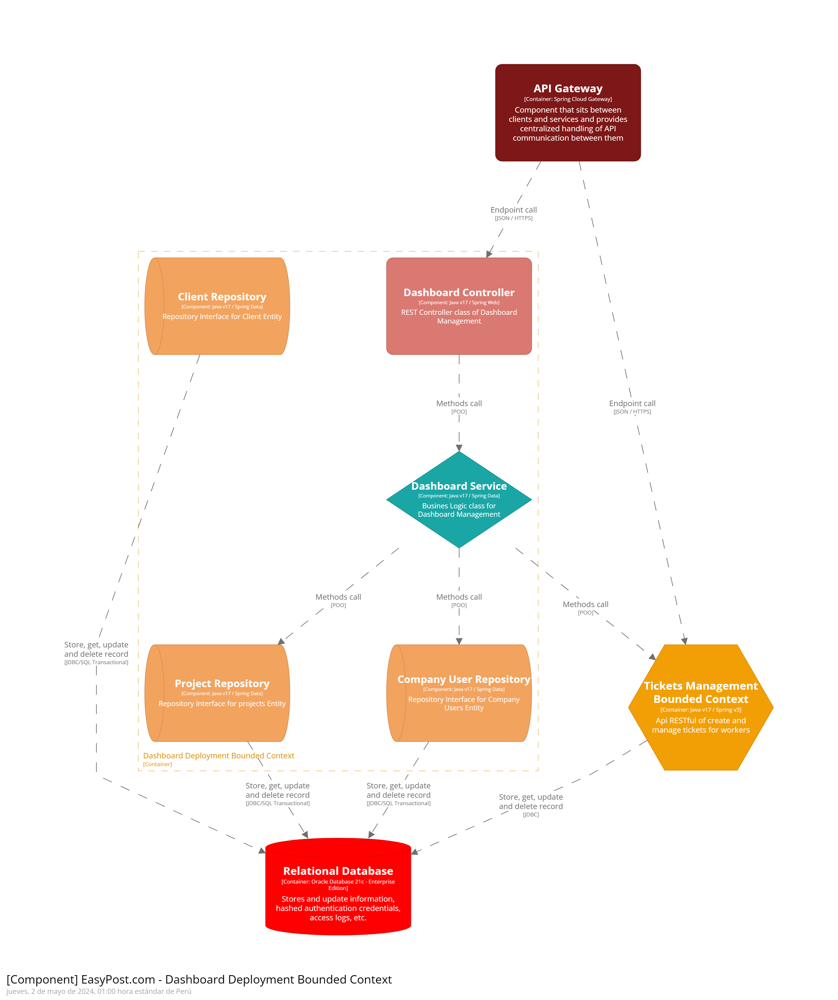
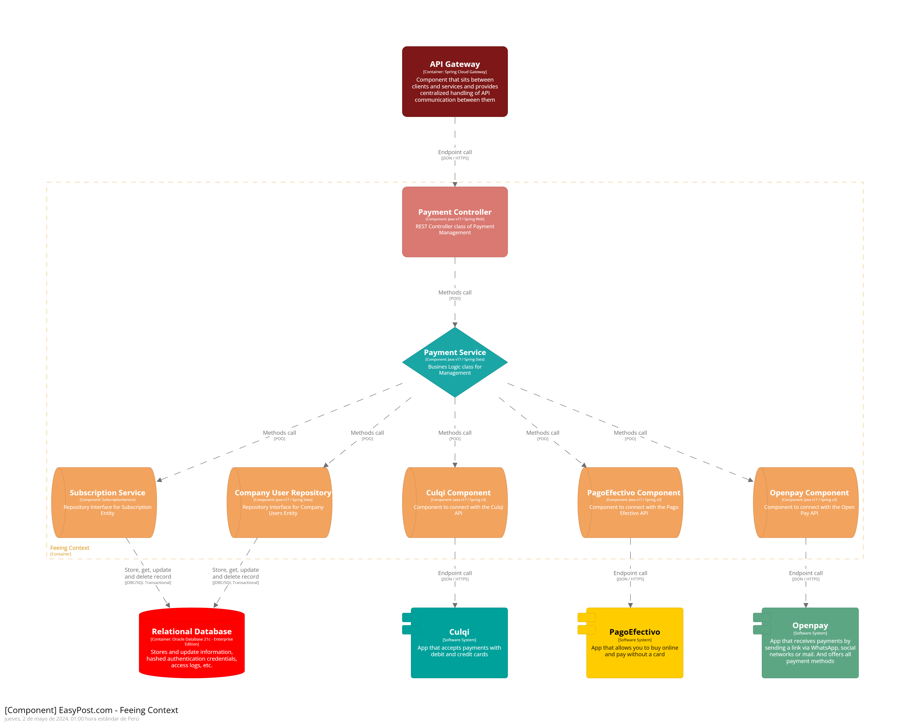
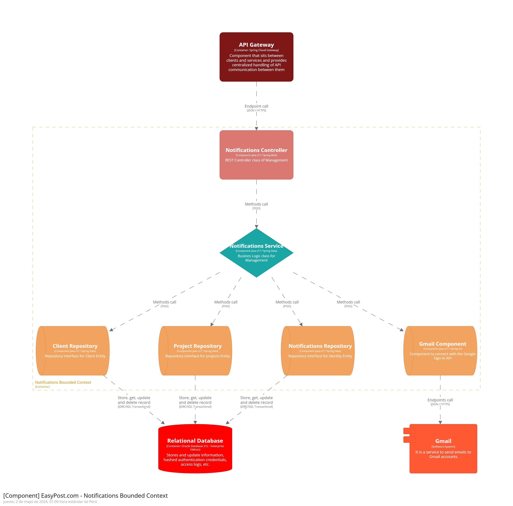

Universidad Peruana de Ciencias Aplicadas

Carrera: Ingeniería de Software

Ciclo: 2024-01

Curso: Aplicaciones Web

Sección: WX56

Profesor: Alex Humberto Sánchez Ponce

Informe del Trabajo Final

Startup: InnovaTec

Producto: EasyPost

Integrantes:
- 
-
- Ticona luque, Rony Piero - U201420422
- Quilla Luyo, Jorge Gerardo - U20211B197
- Ybañez Esquerre, Miguel Angel - U20201B298
- Avellaneda Ramos, Carlos Edward - U201923994

Junio del 2024

---
# Registro de Versiones del Informe

| Versión | Fecha      | Autor                                                                                               | Descripción de la modificación                                                                                     |
|---------|------------|-----------------------------------------------------------------------------------------------------|-------------------------------------------------------------------------------------------------------------------------------------|
| 1.00    | 12/04/2024 | -Ybañez Esquerre, Miguel Angel <br>-Quilla Luyo, Jorge Gerardo <br>-Avellaneda Ramos, Carlos Edward<br>-Ticona Luque, Rony Piero | Se creó la portada y el índice del informe, además se finalizaron todos los aspectos relacionados con el perfil de la solución, el perfil de la startup y la descripción de los antecedentes y problemáticas, así como los segmentos objetivo. Se completaron los capítulos de las pautas generales de estilo, los wireframes, mockups y sus correspondientes flujos de trabajo. También se desarrollaron los diagramas C4. |

---
# Project Report Collaboration Insights
TB1: Se han llevado a cabo las tareas asignadas para la entrega TB1 en el repositorio de Github de la organización del equipo, accesible a través del siguiente enlace: Informe-TB1-Web.

Para la elaboración del informe, se han realizado las siguientes actividades:

- Cada integrante ha redactado y creado gráficos en formato Markdown según los puntos asignados, posteriormente se han realizado commits para asegurar que el avance quede registrado en el repositorio.

- Se han elaborado los artefactos necesarios utilizando las herramientas indicadas, y luego se han obtenido los enlaces de imagen correspondientes mediante la funcionalidad de "Issues" dentro del repositorio del informe.

- Se han llevado a cabo reuniones periódicas para coordinar el progreso de los puntos del informe. Además, se han utilizado estas reuniones para comunicar los avances realizados durante el Sprint 1, que se centró en el desarrollo de la Landing Page del proyecto.


---
# Student Outcome
El curso contribuye al cumplimiento del Student Outcome ABET: **ABET – EAC - Student Outcome 3** <br> Criterio: *Capacidad de comunicarse efectivamente con un rango de audiencias.*

En el siguiente cuadro se describe las acciones realizadas y enunciados de conclusiones por parte del grupo, que permiten sustentar el haber alcanzado el logro del ABET – EAC - Student Outcome 3.

| Criterio específico | Acciones realizadas                                                                                                                                                                                                                                                                                                                                                                                                                                                                                                          | Conclusiones |
| - |------------------------------------------------------------------------------------------------------------------------------------------------------------------------------------------------------------------------------------------------------------------------------------------------------------------------------------------------------------------------------------------------------------------------------------------------------------------------------------------------------------------------------| - |
| Comunica oralmente sus ideas y/o resultados con objetividad a público de diferentes especialidades y niveles jerarquicos, en el marco del desarrollo de un proyecto en ingeniería. | **Miguel Angel Ybañez Esquerre** <br> ***TB1:*** Participación en el desarrollo del Sprint 1, Source Code Managment y el correcto desarrollo de los repositorios de GitHub, como el manejo de ramas, creación de la organización y merge<br><br> **Quilla Luyo Jorge Gerardo** <br> ***TB1:*** Desarrollo del capítulo 1 del informe y entrevista <br> <br> **Carlos Edward Avellaneda Ramos** <br> ***TB1:*** Capitulo 4 del informe asi como la landing page y base de datos, se hizo la entrevista a 3 ingenieros<br><br> **Rony Piero Ticona Luque**<br>***TB1:*** Desarrollo del capítulo 2 del informe y entrevista <br><br> | ***TB1:*** Las responsabilidades fueron asignadas de manera individual para que cada miembro se enfocara en un área específica del trabajo. Una vez asignadas, todos completamos nuestras respectivas tareas de manera exitosa. Al concluir, cada integrante del equipo pudo expresar sus ideas de forma efectiva durante las comunicaciones verbales. | 
| Comunica en forma escrita ideas y/o resultados con objetividad a público de diferentes especialidades y niveles jerarquicos, en el marco del desarrollo de un proyecto en ingeniería. | ***Miguel Angel Ybañez Esquerre*** <br> ***TB1:*** Se analizaron las convenciones de codigo para el correcto desarrollo de features, landing page y proximamente el web app <br> <br> ***Quilla Luyo Jorge Gerardo*** <br> ***TB1:*** Análisis de entrevista y cambios en las ramas. <br> <br> ***Carlos Edward Avellaneda Ramos*** <br> ***TB1:*** Análisis de entrevista y manejo del landing page. <br><br> ***Rony Piero Ticona Luque*** <br> ***TB1:*** Análisis de competencia, análisis de entrevista, user personas, journey mapping y empathy mapping. <br>                                                                                                                  | ***TB1:*** Durante este sprint, cada integrante del equipo se dedicó al desarrollo de los elementos designados para esta entrega. Posteriormente, cada uno comunicó sus contribuciones de manera formal y por escrito, asegurando así una presentación coherente y efectiva de nuestros avances. <br>  |

---
# Contenido
## Tabla de contenidos

### [Capítulo I: Introducción](#capítulo-i-introducción)
- [1.1. Startup Profile](#11-startup-profile)
    - [1.1.1 Descripción de la Startup](#111-descripción-de-la-startup)
    - [1.1.2 Perfiles de integrantes del equipo](#112-perfiles-de-integrantes-del-equipo)
- [1.2 Solution Profile](#12-solution-profile)
    - [1.2.1 Antecedentes y problemática](#121-antecedentes-y-problemática)
    - [1.2.2 Lean UX Process](#122-lean-ux-process)
        - [1.2.2.1. Lean UX Problem Statements](#1221-lean-ux-problem-statements)
        - [1.2.2.2. Lean UX Assumptions](#1222-lean-ux-assumptions)
        - [1.2.2.3. Lean UX Hypothesis Statements](#1223-lean-ux-hypothesis-statements)
        - [1.2.2.4. Lean UX Canvas](#1224-lean-ux-canvas)
- [1.3. Segmentos objetivo](#13-segmentos-objetivo)

### [Capítulo II: Requirements Elicitation & Analysis](#capítulo-ii-requirements-elicitation--analysis)
- [2.1. Competidores](#21-competidores)
    - [2.1.1. Análisis competitivo](#211-análisis-competitivo)
    - [2.1.2. Estrategias y tácticas frente a competidores](#212-estrategias-y-tácticas-frente-a-competidores)
- [2.2. Entrevistas](#22-entrevistas)
    - [2.2.1. Diseño de entrevistas](#221-diseño-de-entrevistas)
    - [2.2.2. Registro de entrevistas](#222-registro-de-entrevistas)
    - [2.2.3. Análisis de entrevistas](#223-análisis-de-entrevistas)
- [2.3. Needfinding](#23-needfinding)
    - [2.3.1. User Personas](#231-user-personas)
    - [2.3.2. User Task Matrix](#232-user-task-matrix)
    - [2.3.3. User Journey Mapping](#233-user-journey-mapping)
    - [2.3.4. Empathy Mapping](#234-empathy-mapping)
    - [2.3.5. As-is Scenario Mapping](#235-as-is-scenario-mapping)
- [2.4. Ubiquitous Language](#24-ubiquitous-language)

### [Capítulo III: Requirements Specification](#capítulo-iii-requirements-specification)
- [3.1. To-Be Scenario Mapping](#31-to-be-scenario-mapping)
- [3.2. User Stories](#32-user-stories)
- [3.3. Impact Mapping](#33-impact-mapping)
- [3.4. Product Backlog](#34-product-backlog)

### [Capítulo IV: Product Design](#capítulo-iv-product-design)
- [4.1. Style Guidelines](#41-style-guidelines)
    - [4.1.1. General Style Guidelines](#411-general-style-guidelines)
    - [4.1.2. Web Style Guidelines](#412-web-style-guidelines)
- [4.2. Information Architecture](#42-information-architecture)
    - [4.2.1. Organization Systems](#421-organization-systems)
    - [4.2.2. Labeling Systems](#422-labeling-systems)
    - [4.2.3. SEO Tags and Meta Tags](#423-seo-tags-and-meta-tags)
    - [4.2.4. Searching Systems](#424-searching-systems)
    - [4.2.5. Navigation Systems](#425-navigation-systems)
- [4.3. Landing Page UI Design](#43-landing-page-ui-design)
    - [4.3.1. Landing Page Wireframe](#431-landing-page-wireframe)
    - [4.3.2. Landing Page Mock-up](#432-landing-page-mock-up)
- [4.4. Web Applications UX/UI Design](#44-web-applications-uxui-design)
    - [4.4.1. Web Applications Wireframes](#441-web-applications-wireframes)
    - [4.4.2. Web Applications Wireflow Diagrams](#442-web-applications-wireflow-diagrams)
    - [4.4.3. Web Applications Mock-ups](#443-web-applications-mock-ups)
    - [4.4.4. Web Applications User Flow Diagrams](#444-web-applications-user-flow-diagrams)
- [4.5. Web Applications Prototyping](#45-web-applications-prototyping)
- [4.6. Domain-Driven Software Architecture](#46-domain-driven-software-architecture)
    - [4.6.1. Software Architecture Context Diagram](#461-software-architecture-context-diagram)
    - [4.6.2. Software Architecture Container Diagrams](#462-software-architecture-container-diagrams)
    - [4.6.3. Software Architecture Components Diagrams](#463-software-architecture-components-diagrams)
- [4.7. Software Object-Oriented Design](#47-software-object-oriented-design)
    - [4.7.1. Class Diagrams](#471-class-diagrams)
    - [4.7.2. Class Dictionary](#472-class-dictionary)
- [4.8. Database Design](#48-database-design)
    - [4.8.1. Database Diagram](#481-database-diagram)

### [Capítulo V: Product Implementation, Validation & Deployment](#capítulo-v-product-implementation-validation--deployment)
- [Registro de Versiones del Informe](#registro-de-versiones-del-informe)
- [Project Report Collaboration Insights](#project-report-collaboration-insights)
- [Student Outcome](#student-outcome)
- [Contenido](#contenido)
  - [Tabla de contenidos](#tabla-de-contenidos)
    - [Capítulo I: Introducción](#capítulo-i-introducción)
    - [Capítulo II: Requirements Elicitation \& Analysis](#capítulo-ii-requirements-elicitation--analysis)
    - [Capítulo III: Requirements Specification](#capítulo-iii-requirements-specification)
    - [Capítulo IV: Product Design](#capítulo-iv-product-design)
    - [Capítulo V: Product Implementation, Validation \& Deployment](#capítulo-v-product-implementation-validation--deployment)
- [Capítulo I: Introducción](#capítulo-i-introducción-1)
  - [1.1. Startup Profile](#11-startup-profile)
    - [1.1.1 Descripción de la Startup](#111-descripción-de-la-startup)
    - [1.1.2 Perfiles de integrantes del equipo](#112-perfiles-de-integrantes-del-equipo)
  - [1.2 Solution Profile](#12-solution-profile)
    - [1.2.1 Antecedentes y problemática](#121-antecedentes-y-problemática)
    - [1.2.2 Lean UX Process](#122-lean-ux-process)
      - [1.2.2.1. Lean UX Problem Statements](#1221-lean-ux-problem-statements)
      - [1.2.2.2. Lean UX Assumptions](#1222-lean-ux-assumptions)
      - [1.2.2.3. Lean UX Hypothesis Statements](#1223-lean-ux-hypothesis-statements)
      - [1.2.2.4. Lean UX Canvas](#1224-lean-ux-canvas)
  - [1.3. Segmentos objetivo](#13-segmentos-objetivo)
- [Capítulo II: Requirements Elicitation \& Analysis](#capítulo-ii-requirements-elicitation--analysis-1)
  - [2.1 Competidores](#21-competidores)
  - [2.2. Entrevistas](#22-entrevistas)
    - [2.2.1. Diseño de entrevistas](#221-diseño-de-entrevistas)
    - [2.2.2. Registro de entrevistas](#222-registro-de-entrevistas)
      - [Entrevista 1](#entrevista-1)
      - [Entrevista 2](#entrevista-2)
  - [2.3. Needfinding](#23-needfinding)
    - [2.3.1. User Personas](#231-user-personas)
    - [2.3.2. User Task Matrix](#232-user-task-matrix)
    - [2.3.3. User Journey Mapping](#233-user-journey-mapping)
    - [2.3.4. Empathy Mapping](#234-empathy-mapping)
    - [2.3.5. As-is Scenario Mapping](#235-as-is-scenario-mapping)
  - [2.4. Ubiquitous Language](#24-ubiquitous-language)
- [Capítulo III: Requirements Specification](#capítulo-iii-requirements-specification-1)
  - [3.1. To-Be Scenario Mapping](#31-to-be-scenario-mapping)
  - [3.2. User Stories](#32-user-stories)
  - [3.3. Impact Mapping](#33-impact-mapping)
  - [3.4. Product Backlog](#34-product-backlog)
- [Capítulo IV: Product Design](#capítulo-iv-product-design-1)
- [4.1. Style Guidelines](#41-style-guidelines)
  - [4.1.1. General Style Guidelines](#411-general-style-guidelines)
  - [4.1.2. Web Style Guidelines](#412-web-style-guidelines)
- [4.2. Information Architecture](#42-information-architecture)
  - [4.2.1. Organization Systems](#421-organization-systems)
  - [4.2.2. Labeling Systems](#422-labeling-systems)
  - [4.2.3. SEO Tags and Meta Tags](#423-seo-tags-and-meta-tags)
  - [4.2.4. Searching Systems](#424-searching-systems)
  - [4.2.5. Navigation Systems](#425-navigation-systems)
  - [4.3. Landing Page UI Design](#43-landing-page-ui-design)
    - [4.3.1. Landing Page Wireframe](#431-landing-page-wireframe)
    - [4.3.2. Landing Page Mock-upX](#432-landing-page-mock-upx)
      - [Encabezado y Navegación](#encabezado-y-navegación)
      - [Sección de Descripción](#sección-de-descripción)
      - [Nuestros Servicios](#nuestros-servicios)
      - [Nuestros Proyectos](#nuestros-proyectos)
      - [Pie de Página](#pie-de-página)
  - [4.4. Web Applications UX/UI Design](#44-web-applications-uxui-design)
    - [4.4.1. Web Applications Wireframes](#441-web-applications-wireframes)
    - [4.4.2. Web Applications Wireflow Diagrams](#442-web-applications-wireflow-diagrams)
    - [4.4.2. Web Applications Mock-ups](#442-web-applications-mock-ups)
    - [4.4.3. Web Applications User Flow Diagrams](#443-web-applications-user-flow-diagrams)
  - [4.5. Web Applications Prototyping](#45-web-applications-prototyping)
  - [4.6. Domain-Driven Software Architecture](#46-domain-driven-software-architecture)
    - [4.6.1. Software Architecture Context Diagram](#461-software-architecture-context-diagram)
    - [4.6.2. Software Architecture Container Diagrams](#462-software-architecture-container-diagrams)
    - [4.6.3. Software Architecture Components Diagrams](#463-software-architecture-components-diagrams)
      - [4.6.3.1 Client Interaction Boundend Context](#4631-client-interaction-boundend-context)
      - [4.6.3.2 Client Interaction Boundend Context](#4632-client-interaction-boundend-context)
      - [4.6.3.3 Design and Planning Boundend Context](#4633-design-and-planning-boundend-context)
      - [4.6.3.4 Document and Report Boundend Context](#4634-document-and-report-boundend-context)
      - [4.6.3.5 Georeferencing And Mapping Boundend Context](#4635-georeferencing-and-mapping-boundend-context)
  - [4.7. Software Object-Oriented Design](#47-software-object-oriented-design)
    - [4.7.1. Class Diagrams.](#471-class-diagrams)
    - [Clases Principales](#clases-principales)
      - [Usuario](#usuario)
      - [Proyecto](#proyecto)
      - [Ticket](#ticket)
      - [Documento](#documento)
      - [Georreferencia](#georreferencia)
    - [Relaciones](#relaciones)
    - [Métodos Clave](#métodos-clave)
    - [Automatización y Escalabilidad](#automatización-y-escalabilidad)
    - [4.7.2. Class Dictionary.](#472-class-dictionary)
  - [4.8. Database Design.](#48-database-design)
    - [4.8.1. Database Diagram.](#481-database-diagram)
    - [Entidades Principales](#entidades-principales)
      - [Usuarios](#usuarios)
      - [Proyectos](#proyectos)
      - [Tickets](#tickets)
      - [Documentos y Reportes](#documentos-y-reportes)
      - [Georreferenciación](#georreferenciación)
    - [Relaciones](#relaciones-1)
    - [Automatización y Soporte de Decisiones](#automatización-y-soporte-de-decisiones)
    - [Escalabilidad y Flexibilidad](#escalabilidad-y-flexibilidad)
- [Capítulo V: Product Implementation, Validation \& Deployment](#capítulo-v-product-implementation-validation--deployment-1)
  - [5.1. Software Configuration Management](#51-software-configuration-management)
    - [5.1.1. Software Development Environment Configuration](#511-software-development-environment-configuration)
    - [5.1.2. Source Code Management](#512-source-code-management)
    - [Master branch](#master-branch)
    - [Develop branch](#develop-branch)
    - [Release branch](#release-branch)
    - [Feature branches](#feature-branches)
    - [Hotfix branch](#hotfix-branch)
    - [Semantic Versioning](#semantic-versioning)
    - [Conventional Commits](#conventional-commits)
    - [Types](#types)
    - [optional scope](#optional-scope)
    - [5.1.3. Source Code Style Guide \& Conventions](#513-source-code-style-guide--conventions)
    - [HTML](#html)
    - [CSS](#css)
    - [JavaScript](#javascript)
    - [Vue](#vue)
    - [C#](#c)
    - [Gherkin](#gherkin)
    - [5.1.4. Software Deployment Configuration](#514-software-deployment-configuration)
  - [5.2. Landing Page, Services \& Applications Implementation](#52-landing-page-services--applications-implementation)
    - [5.2.1. Sprint 1](#521-sprint-1)
      - [5.2.1.1. Sprint Planning 1](#5211-sprint-planning-1)
      - [5.2.1.2. Sprint Backlog 1](#5212-sprint-backlog-1)
      - [5.2.1.3. Development Evidence for Sprint Review](#5213-development-evidence-for-sprint-review)
      - [5.2.1.4. Testing Suite Evidence for Sprint Review](#5214-testing-suite-evidence-for-sprint-review)
      - [5.2.1.5. Execution Evidence for Sprint Review](#5215-execution-evidence-for-sprint-review)
      - [5.2.1.6. Services Documentation Evidence for Sprint Review](#5216-services-documentation-evidence-for-sprint-review)
      - [5.2.1.7. Software Deployment Evidence for Sprint Review](#5217-software-deployment-evidence-for-sprint-review)
      - [5.2.1.8. Team Collaboration Insights during Sprint](#5218-team-collaboration-insights-during-sprint)
- [Conclusiones](#conclusiones)
    - [Conclusiones y recomendaciones](#conclusiones-y-recomendaciones)
    - [Video About-the-Team](#video-about-the-team)
- [Bibliografía](#bibliografía)

---
# Capítulo I: Introducción
## 1.1. Startup Profile
### 1.1.1 Descripción de la Startup
Somos InnovaTec, una startup conformada por estudiantes de la Universidad Peruana de Ciencias Aplicadas. Nos encargamos de solucionar problemáticas con ayuda de herramientas tecnológicas con el fin de automatizar y facilitar procesos.

En esta oportunidad presentamos EasyPost, una aplicación web la cual ofrece herramientas y trámites para realizar seguimiento a proyectos de instalación de postes en lugares solicitados por nuestros clientes. Nuestra aplicación ofrece transparencia a lo largo de este proceso para garantizar confianza, además de ofrecer ventajas dentro de nuestra aplicación para que los usuarios registrados se sientan conformes y cuenten con nosotros en otra oportunidad.

**Misión:** Facilitar y optimizar este proceso con ayuda de nuestra plataforma. Nuestra startup se compromete a brindar transparencia, eficiencia y confianza a nuestros clientes.

**Visión:** Ser la empresa con una solución innovadora para la problemática de este sector, ofreciendo simplificación y mejora a este proceso

### 1.1.2 Perfiles de integrantes del equipo
**Nombre: Jorge Gerardo Quilla Luyo**

Código: U20211B197

Carrera: Ingeniería de Software

Acerca de mí:

Me considero una persona puntual y comprometida con los trabajos en grupo, siempre intento ayudar a lo largo del trabajo en desarrollo. También me esfuerzo en comunicar los resultados e investigar temas nuevos por cuenta propia.


**Nombre: Carlos Edward Avellaneda Ramos**

Código: U201923994

Carrera: Ingeniería de Software

Acerca de mí:

Soy Carlos Avellaneda, estudiante de la carrera de Ingenieria de Software en la Universidad Peruana de Ciencias Aplicadas (UPC). Cuento con conocimientos en distintos lenguajes, tales como: Java, C++, Python y conocimientos básicos en C#. Soy una persona bastante proactiva y espero que eso ayude en el desarrollo de nuestra startup grupal.


Nombre completo: Miguel Angel Ybañez Esquerre

Código de estudiante: U20201B298

Carrera: Ingeniería de Software

Acerca de mí: Soy una persona amigable, me gusta hacer creación de contenido, y también me agrada el trabajo en equipo. Tengo experiencia en Frontend y Backend, he realizado proyectos para empresas pequeñas. Me especializo en la programación y tengo conocimientos en la creación de páginas web y videojuegos. Además de usar herramientas para edición de imágenes o videos.


**Nombre: Rony Piero Ticona Luque**

Código: U201420422

Carrera: Ingeniería de Software

Acerca de mí:

Me considero una persona responsable y comprometida con las actividades académicas en especial con los trabajos grupales, buscando constantemente oportunidades para colaborar y contribuir durante el proceso. Asimismo, me dedico a comunicar efectivamente los resultados obtenidos.


## 1.2 Solution Profile
Para comprender la solución debemos detallar aspectos que se abordarán a lo largo del proyecto y qué metas tendremos.

### 1.2.1 Antecedentes y problemática
- **What(Qué):**
  A lo largo del proceso, el cliente recibe informes con todos los detalles, o existe una comunicación con todo lo involucrado del proyecto. Sin embargo, ambas partes podrían presentar dificultades para comunicar resultados o avances del proyecto en curso.

- **Why(Por qué)**
  El proyecto, en sus inicios, debe detallarse para evitar confusiones o errores. Muchas veces puede perderse o desviarse del propósito de esta instalación en la ubicación solicitada. En consecuencia, demoras o postergaciones en la instalación que prometía ofrecer servicios esenciales en los alrededores de la zona.

- **Who(Quién)**
  La falta de seguimiento a este tipo de proyectos puede resultar en problemas para la empresa encargada de la instalación, la población de los alrededores y aquella empresa que está manejando todas las etapas del proyecto.

- **When(Cuándo)**
  El proyecto puede verse afectado en distintos momentos, a inicios, durante y al final de este mismo. Además se debe considerar que existen fechas definidas en los contratos, por lo que otra etapa del gran proyecto que se está llevando a cabo puede verse afectada.

- **Where(Dónde)**
  Esta problemática afecta la ubicación donde se ha solicitado la instalación del poste. La falta de seguimiento en este proceso afectará las siguientes etapas.

- **How(Cómo)**
  El procedimiento que se lleve a cabo para la instalación debe cumplir con los detalles de la solicitud realizada por el cliente. Muchas veces hay problemas cuando no se cumplen los requisitos establecidos de esta solicitud realizada, terminando en problemas en las etapas o en los hitos de este proyecto.

- **How much(Cuánto)**
  Es importante cotizar correctamente la cantidad de postes que se necesitarán en la ubicación deseada, así para evitar costes que se salgan del presupuesto o compras de materiales que sean  innecesarias.

### 1.2.2 Lean UX Process
#### 1.2.2.1. Lean UX Problem Statements
**Segmento Empresas de Instalación de postes**

Hemos notado que las empresas que se dedican a la instalación de postes actualmente no están del todo digitalizadas, muchas aún operan de forma manual al momento de realizar un proyecto. Muchas terminan con problemas debido a la falta de automatización de operaciones. Además que tienen limitaciones en cuanto a la comunicación con los contratistas correspondientes, los cuales en gran medida solicitan avances, reuniones o recopilar información del proyecto en curso.

¿Cómo podemos facilitar este tipo de procesos a las empresas que se dedican a la instalación de postes para que sus clientes queden satisfechos con su trabajo?

**Segmento Empresas Contratistas**

Hemos notado que las empresas que solicitan instalación de postes, necesitan estar informados sobre todos los requerimientos que llevará este proyecto, ya que en su mayoría la instalación de estos postes suele ser el primer paso de otro proyecto que suelen proporcionar servicios esenciales a comunidades o la población alrededor de la ubicación solicitada. Por lo tanto debe existir una comunicación eficiente y transparente por parte de la empresa a la que se está contratando.

¿Cómo podríamos facilitar el seguimiento a las empresas contratistas para evitar que el proyecto que se lleve a cabo no se vea afectado por la falta de comunicación con el proyecto de instalación de postes?

#### 1.2.2.2. Lean UX Assumptions
**Asumimos que**

Empresa: Necesita contar con las herramientas digitales necesarias para detallar el proceso de instalación, y comunicarse de manera rápida y eficiente con la empresa que los contrató.

Cliente: Necesita realizar un seguimiento detallado de inicio a fin del proyecto de instalación

**Estas necesidades se pueden resolver con**

Empresa: una aplicación que permita ingresar todos los detalles del proyecto de instalación de postes

Cliente:  una sección en nuestra aplicación que permita ver con detalle o realizar un seguimiento a la empresa que se ha contratado.

**Mis clientes iniciales serán** empresas que instalan postes para distintos servicios, y contratistas que lleven a cabo un proyecto el cual incluye la instalación de postes en lugares específicos.

**El valor #1 que un cliente quiere de nuestro servicio** es que la tecnología implementada en la aplicación permite transparencia con la empresa que se ha contratado

**Obtendremos la mayoría de nuestros clientes a través** publicaciones en redes sociales la cual especifique los beneficios de usar nuestra aplicación

**Obtendremos ingresos mediante** membresías para utilizar la aplicación, la cual ofrecerá ventajas para cada segmento objetivo

**Mis competidores serán** otras empresas, públicas o privadas, que estén en el mismo ámbito

**Destacaremos** frente a nuestros competidores al implementar una solución moderna a esta problemática

**El principal riesgo** es una interfaz difícil de operar o poco detalle en la visualización para realizar los respectivos seguimientos al proyecto de instalación de postes.

**Resolveremos esto a través** de buenas prácticas para desarrollar la aplicación web, ofrecer una interfaz sencilla de manipular y resultados veraces y detallados del proyecto en curso.

#### 1.2.2.3. Lean UX Hypothesis Statements
**Hypothesis Statement 1**

Creemos que nuestra aplicación permitirá transparencia por cada procedimiento durante la instalación.
Sabremos que tendremos éxito cuando más empresas se sumen a utilizar esta herramienta tecnológica.

**Hypothesis Statement 2**

Creemos que facilitar la comunicación entre cliente y empresa va a optimizar las etapas de seguimiento.
Sabremos que tuvimos éxito, si al terminar el proyecto de instalación de postes no se tuvo reportes de postergación o demoras debido a falta de transparencia.

#### 1.2.2.4. Lean UX Canvas


## 1.3. Segmentos objetivo
Debemos reconocer quienes son los principales segmentos de esta solución para establecer metas y límites en el sector. Además, garantizar la efectividad de la solución con nuestra aplicación.

**Cliente:** Muchos proyectos que buscan ayudar ciertas zonas a nivel nacional, ofreciendo servicios esenciales, necesitan primero contar con postes para continuar. Por lo que el cliente se le puede considerar como empresas contratistas las cuales pueden ser públicas o privadas.

**Empresa dedicada a instalación de postes:** Estas empresas están acostumbradas a realizar sus procesos internos y operaciones comerciales de una forma que se ha establecido desde hace mucho tiempo, pero con la innovación tecnológica pueden facilitar y automatizar varias tareas durante las etapas de la instalación de postes.

# Capítulo II: Requirements Elicitation & Analysis
## 2.1 Competidores

Hemos podido identificar a varios competidores que ya llevan mucho tiempo en el mercado, ya que se posicionaron en el mercado por las publicidades, ofertas y recomendaciones de sus clientes, como principales tenemos a TaskRabbit, Thumbtack y HomeAdvisor que tienen asesores dentro de su Plataforma web. Para contrarrestar esto, pensamos hacer publicidad por las redes sociales y trabajar con tiendas pequeñas.

- **TaskRabbit**: TaskRabbit es una plataforma en línea que conecta a personas que necesitan ayuda con tareas domésticas o pequeños trabajos con "Taskers" que pueden realizar esas tareas.
    
- **Thumbtack**: Thumbtack es una plataforma que conecta a usuarios con profesionales locales para una variedad de servicios, incluidos trabajos de reparación, mantenimiento y construcción.
  
- **HomeAdvisor**: HomeAdvisor es un servicio en línea que ayuda a conectar a propietarios de viviendas con profesionales de la construcción, mantenimiento del hogar y mejoras del hogar.


**Estrategias y tácticas frente a competidores**

- **TaskRabbbit**:Tenemos varias similitudes respecto a esta plataforma, en donde nosotros vamos a diferenciarnos con un trabajo más personalizado con el cliente, con precios mas competitivos que esta plataforma, otro punto a favor es nuestro punto de inicio, porque brindaremos promociones con el objetivo de posicionarnos en el mercado.

- **Thumbtack**:Nuestra plataforma tendrá la opción de brindar un servicio personalizado antes del proceso de la construcción de postes. Además, se brindará servicio post acabado de esta forma los clientes tendrán un poste acorde a su hogar.

- **HomeAdvisor**:Nuestra plataforma cuenta con mayor experiencia en el proceso de construcción y en el lado competitivo en decoración brindaremos un espacio virtual para que los clientes puedan tener muestras y poder visualizar como terminaría su proyecto.

## 2.2. Entrevistas

### 2.2.1. Diseño de entrevistas

Entrevista Tecnicos

- Información personal
  
  Nombres y apellidos
  
- Información complementaria
  
  ¿Cómo es que empiezan el proyecto?
  
  ¿Qué muestran el cliente cuando termine el proyecto?

  ¿Se le presentan el cliente mediante un Word con las capturas de google earth?
  
- Presentación del proyecto y preguntas técnicas
  
  ¿Le parece bien para que el cliente lo pueda ver si te web ya pueda ver este el recorrido, cómo vas y si ha sido probado por el estado?
  
  Luego de realizar el diseño y verificar los permisos de cartera ¿qué más faltaría para culminar el proyecto?
  
  ¿En el proceso se requiere automatizar una parte del proyecto?
  
  ¿funcionaria un proceso de ticket en la web para facilitar y tener un control de los procesos?
  
  ¿La parte del proceso de macros que tiene el proceso ayudaría que el sistema lo realice?
  

Entrevista Clientes

- Información personal
  
  Nombres y apellidos
  
- Información complementaria
  
  ¿Tu conoces alguna de estas necesidades de instalaciones de postes?
  
  ¿Qué se debería detallar en esta etapa del proyecto?
  
  ¿Que pasaría si no se hace el respectivo seguimiento a esta instalacion?
  
- Presentación del proyecto
  ¿Qué le pareció la idea de poder realizar la solicitud de instalación de postes desde nuestra aplicacion web?
  
  ¿Qué es lo que le parecería más útil o valioso de nuestra aplicación?
  
  ¿Crees que nuestra aplicación ofrece transparencia en el proceso de instalacion?
  
  ¿Hay algún otro servicio o característica que le gustaría ver agregado a nuestra aplicacion web en un futuro?
  

### 2.2.2. Registro de entrevistas

#### Entrevista 1


**Link de la entrevista:** [Entrevista](https://upcedupe-my.sharepoint.com/:v:/g/personal/u20211b197_upc_edu_pe/EX3SFraCZDhFsBv6fEXWDqcB3VfWzLFtRE4buQAayrgQ5w?e=sc1kxP&nav=eyJyZWZlcnJhbEluZm8iOnsicmVmZXJyYWxBcHAiOiJTdHJlYW1XZWJBcHAiLCJyZWZlcnJhbFZpZXciOiJTaGFyZURpYWxvZy1MaW5rIiwicmVmZXJyYWxBcHBQbGF0Zm9ybSI6IldlYiIsInJlZmVycmFsTW9kZSI6InZpZXcifX0%3D)

**Resumen de la entrevista:** El entrevistado, Mateo Muñoz, es un estudiante de la carrera de Ingeniería de Sistemas. Mateo es consciente del proceso que conlleva los proyectos que incluyen la instalación de postes, tales como la identificación de la necesidad en los alrededores, etapas de planificación de desarrollo y controles de calidad. Esta última etapa la considera importante porque hacer un mal seguimiento podría afectar propiedades aledañas, habrían costos adicionales y el plazo de entrega se vería afectado. Opina que EasyPost ayudará a las empresas que instalan postes, ya que gracias a las herramientas de seguimiento de proyectos podrán ofrecer transparencia con su cliente respectivo.

#### Entrevista 2


**Link de la entrevista:** [Entrevista](https://youtu.be/J6JVWyPkIjY)

**Resumen de la entrevista:** La entrevista aborda el proceso y las fases involucradas en la realización de un proyecto de tendido de fibra óptica, desde la concepción inicial hasta la finalización y entrega al cliente, incluyendo el uso de tecnología y software para mejorar la eficiencia y la comunicación cliente-empresa.

El proyecto inicia con una fase de diseño, donde se realiza un estudio de viabilidad que incluye la recopilación de información a través de fotografías y georreferenciación mediante GPS. Este diseño preliminar se presenta al cliente en documentos de Word con capturas de Google Earth o como un archivo KMZ georreferenciado, junto con un reporte fotográfico.

Además de la fase de diseño, se menciona la importancia de la gestión de permisos, que es vital para la realización del proyecto, especialmente cuando este se ubica cerca de vías públicas o zonas protegidas, requiriendo autorizaciones de diversas entidades como el Ministerio de Cultura o empresas de servicios públicos.

Se destacó la idea de desarrollar un sitio web interactivo que permita a los clientes visualizar el progreso del proyecto y acceder a datos relevantes. Este portal también podría incluir funciones para la gestión de tickets por diferentes grupos de trabajo (como Nitrógenos, Networking, Averías, etc.), asignación de tareas, y reportes de avance, mejorando la comunicación y eficiencia en la gestión de proyectos.

Se habló sobre la posibilidad de automatizar ciertos procesos y utilizar software para controlar el flujo de información y trabajos. La creación de una base de datos flexible, posiblemente utilizando MongoDB, y la consideración de aspectos técnicos como hosting y desarrollo de frontend fueron discutidos como pasos futuros.

Finalmente, se mencionó la intención de estructurar bien el sitio, definiendo los roles de los usuarios y sus funcionalidades para facilitar la interacción y la gestión de datos. El proceso terminaría con el diseño y la implementación de la interfaz de usuario, con un enfoque en la estética y la usabilidad.


#### Entrevista 3


**Link de la entrevista:** [Entrevista](https://upcedupe-my.sharepoint.com/:v:/g/personal/u201420422_upc_edu_pe/EftWhYvfPk5KiNNk_UqTUxsBWm_UQ6K7C7u-n8CFruqFeg?e=V2HFgq&nav=eyJyZWZlcnJhbEluZm8iOnsicmVmZXJyYWxBcHAiOiJTdHJlYW1XZWJBcHAiLCJyZWZlcnJhbFZpZXciOiJTaGFyZURpYWxvZy1MaW5rIiwicmVmZXJyYWxBcHBQbGF0Zm9ybSI6IldlYiIsInJlZmVycmFsTW9kZSI6InZpZXcifX0%3D)

**Resumen de la entrevista:** En la entrevista se menciona la problemática que ocurre sobre las instalaciones de postes y su seguimiento, Alexandra tiene el conocimiento de la empresa Enel es la que tiene mayor participación en este tipo de procesos. Nos comenta que en un proyecto de instalación de postes los puntos que se debe detallar deben tener la información a la disposición como el lugar las dimensiones, el tipo de material. En caso no se realice un seguimiento adecuado puede terminar en proyectos defectuoso. En esta parte de la entrevista se comenta del proyecto de la página web EasyPost, le parece una plataforma confiable ya que brinda información del paso a paso cómo va el proyecto de la instalación, una de los puntos mas importante es la transparencia de los datos que la plataforma garantiza y al finalizar la entrevista Alexandra nos brinda sugerencias de un apartado de mantenimiento de los postes ya instalados para una futura reparación..

## 2.3. Needfinding
### 2.3.1. User Personas


### 2.3.2. User Task Matrix

**Usuario Sistemas**

| Tipo | Frecuencia | Importancia |
| - | - | - |
| Buscar proyecto de postes | Siempre | Media |
| Ver en qué parte del proceso se encuentra | Siempre | Alta |
| Ver cantidad de tickes | Siempre | Alta |
| Direccionar tareas | A veces | Alta |
| Subir información del proyecto | Siempre | Alta |
| Actualizar tareas | Siempre | Alta |
| Visualizar cuadro de trabajos realizados | A veces | Media |
| Enviar mensajes internos a responsables | Siempre | Alta |
| Descargar estatus del proyecto | A veces | Media |

**Usuario Cliente**

| Tipo | Frecuencia | Importancia |
| - | - | - |
| Ver proyectos en la pagina | Siempre | Media |
| Ver disponibilidad de servicio | Siempre | Media |
| Solicitar cita | A veces | Alta |
| Comunicarse con agente disponible | Siempre | Media |
| Brindar información del domicilio para la cita | Siempre | Alta |
| Descargar resultado de cita | Siempre | Alta |
| Enviar documentos solicitados | A veces | Media |

**Usuario Cliente Company**

| Tipo | Frecuencia | Importancia |
| - | - | - |
| Ver proyectos en la pagina | Siempre | Alta |
| Reportes de instalaciones | Siempre | Alta |
| Tickes de servicio | A veces | Alta |
| Visualizar datos de usuario | Siempre | Media |
| Ver documentos de clientes | A veces | Media |
| Avance del proyecto | A veces | Alta |
| Asignar tareas a resposables | Siempre | Alta |
| Confirmación del proyecto | A veces | Media |

### 2.3.3. User Journey Mapping


### 2.3.4. Empathy Mapping


### 2.3.5. As-is Scenario Mapping


## 2.4. Ubiquitous Language

Detalle de palabras especificas

- Cliente: Nos referimos a un empresa publica o privada
- Instalaciones: Proceso de montaje de un poste fisico en via publica o privada
- Postes: Estructuras verticales utilizadas para soportar cables, equipos u otros componentes.
- Diseño: Planificación y creación de la disposición y funcionamiento de las instalaciones.
- Contratación: Proceso de selección y contratacion de personal para llevar a cabo las instalaciones.
- Logística: Coordinación y gestión de los recursos necesarios para realizar las instalaciones de manera eficiente.
- Seguridad: Implementación de medidas para proteger la integridad física de los trabajadores y garantizar la seguridad de las instalaciones.
- Satisfacción del cliente: Medida de cómo los servicios de instalación cumplen con las expectativas y necesidades del cliente.
- Planificación: Etapa inicial donde se establecen los objetivos y se desarrolla la estrategia para llevar a cabo las instalaciones.
- Permisos: Autorizaciones requeridas por las autoridades locales o reguladoras para llevar a cabo ciertas instalaciones.
- Garantía: Compromiso de la empresa de instalación de corregir cualquier problema que surja con las instalaciones dentro de un período de tiempo específico.

# Capítulo III: Requirements Specification
## 3.1. To-Be Scenario Mapping
## 3.2. User Stories
## 3.3. Impact Mapping
## 3.4. Product Backlog

# Capítulo IV: Product Design

# 4.1. Style Guidelines

## 4.1.1. General Style Guidelines
La coherencia visual y la accesibilidad son pilares de nuestro diseño web. Nos enfocamos en crear una experiencia de usuario uniforme a través de colores, tipografías, y elementos de diseño consistentes. Nuestro objetivo es facilitar una interfaz intuitiva y agradable, que refleje la identidad de nuestra marca y mejore la interacción del usuario con nuestra plataforma. Seleccionamos una paleta de colores que refuerza nuestra imagen de marca, con colores primarios, secundarios, y de acento cuidadosamente elegidos para mejorar la legibilidad y la navegación. Las tipografías se eligen para garantizar la legibilidad en diversos dispositivos, manteniendo un equilibrio entre estética y funcionalidad.

## 4.1.2. Web Style Guidelines
Para las interfaces web responsivas, adoptamos un enfoque 'mobile-first', asegurando que nuestro diseño sea efectivo y atractivo en dispositivos móviles, y luego escalando hacia arriba para adaptarse a pantallas más grandes. Los principios de diseño inclusivo guían cada decisión, desde el contraste de colores hasta el tamaño de los elementos interactivos, para asegurar que nuestro sitio sea accesible para todos los usuarios, independientemente de sus capacidades. Implementamos también un sistema de diseño modular, lo que nos permite reutilizar componentes y garantizar consistencia a través de la experiencia del usuario.

# 4.2. Information Architecture

## 4.2.1. Organization Systems
Nuestra arquitectura de información se estructura alrededor de sistemas de organización claramente definidos. Utilizamos una combinación de organización jerárquica para estructurar el contenido por importancia y relevancia, y organización secuencial para guiar a los usuarios a través de procesos paso a paso. Para categorizar contenido, aplicamos esquemas temáticos, permitiendo a los usuarios encontrar información basada en temas específicos o áreas de interés. La organización por audiencia también juega un papel crucial, segmentando el contenido para diferentes grupos de usuarios, asegurando que la información sea relevante y fácilmente accesible.

## 4.2.2. Labeling Systems
Nuestro sistema de etiquetado está diseñado para claridad y simplicidad. Utilizamos etiquetas intuitivas y descriptivas para grupos de información y enlaces, reduciendo la ambigüedad y mejorando la navegación. Cada etiqueta es el resultado de un análisis detallado de la terminología más comprensible para nuestro público objetivo, asegurando que la estructura de la información sea fácil de entender y seguir.

## 4.2.3. SEO Tags and Meta Tags
Optimizamos nuestro sitio web para motores de búsqueda a través de un uso estratégico de SEO tags y meta tags. Para cada página principal, definimos títulos únicos y descripciones meta que reflejan el contenido y las keywords clave. Esto mejora la visibilidad y el ranking en resultados de búsqueda. Además, implementamos tags para redes sociales, asegurando que el contenido compartido se vea atractivo y sea coherente con nuestra marca.

## 4.2.4. Searching Systems
Para mejorar la búsqueda de información dentro de nuestro producto digital, implementamos sistemas de búsqueda avanzada con opciones de filtrado por categoría, fecha, y tipo de contenido. Nuestro objetivo es minimizar el tiempo que los usuarios pasan buscando información, proporcionando resultados relevantes y organizados de manera intuitiva. Estos sistemas se diseñan pensando en la facilidad de uso, con sugerencias de búsqueda y corrección automática de errores comunes de entrada.

## 4.2.5. Navigation Systems
Nuestro sistema de navegación está diseñado para ser intuitivo y eficiente, permitiendo a los usuarios moverse por el sitio sin esfuerzo. Utilizamos menús claramente estructurados, breadcrumbs para indicar la ubicación actual dentro del sitio, y enlaces de navegación lógica para guiar a los usuarios. El diseño responsivo asegura que la navegación sea coherente en todos los dispositivos, y las acciones comunes están accesibles desde cualquier punto dentro del sitio, reduciendo la cantidad de clics necesarios para llegar al destino deseado.

## 4.3. Landing Page UI Design

### 4.3.1. Landing Page Wireframe


### 4.3.2. Landing Page Mock-upX

La página de inicio de EasyPost está diseñada para ofrecer una experiencia informativa y funcional a sus usuarios, reflejando el compromiso de la empresa con la vanguardia en proyectos de infraestructura de fibra óptica. La estructura de la página se detalla a continuación:

#### Encabezado y Navegación

- **Logo:** Situado en la parte superior izquierda, actúa como un punto de referencia visual para la marca.
- **Menú de Navegación:** Incluye enlaces a secciones importantes del sitio como "Para empresas", "Para usuarios", y "Sobre Nosotros", además de botones para "Registrarme" e "Iniciar Sesión", facilitando la navegación y la interacción con el sitio.

#### Sección de Descripción

- **Imagen de Fondo:** Presenta una fotografía relacionada con la industria, estableciendo el contexto visual.
- **Texto Descriptivo:** Expone el papel de EasyPost en la industria de la fibra óptica, ofreciendo actualizaciones detalladas sobre los proyectos y fomentando la transparencia y la comunicación con los interesados.

#### Nuestros Servicios

- **Listado de Servicios:** Se detallan los servicios clave como la "Gestión Integral de Proyectos", "Visualización de Avances en Tiempo Real", y "Automatización y Personalización", cada uno acompañado por una descripción de su valor añadido.
- **Descripciones Detalladas:** Se proporcionan explicaciones sobre cómo cada servicio mejora la gestión y ejecución de los proyectos, destacando la importancia de la plataforma para la planificación y el seguimiento.

#### Nuestros Proyectos

- **Galería de Proyectos:** Muestra ejemplos de proyectos con imágenes y descripciones breves, ofreciendo una vista previa del tipo de trabajos realizados.
- **Botón de "Ver más":** Invita a los usuarios a explorar más a fondo el portafolio de proyectos de la empresa.

#### Pie de Página

- **Información Adicional:** Incluye un menú de navegación secundario y detalles sobre la empresa, tales como oportunidades de empleo y formas de contacto.
- **Derechos de Autor:** Un recordatorio de los derechos reservados de la empresa, reforzando la identidad de la marca.

La página está diseñada siguiendo los principios de diseño web moderno, incluyendo el diseño inclusivo y una arquitectura de la información bien estructurada, todo ello dentro del marco del sistema de diseño establecido para los productos digitales de la empresa.


## 4.4. Web Applications UX/UI Design

### 4.4.1. Web Applications Wireframes

### 4.4.2. Web Applications Wireflow Diagrams

### 4.4.2. Web Applications Mock-ups

### 4.4.3. Web Applications User Flow Diagrams


## 4.5. Web Applications Prototyping

## 4.6. Domain-Driven Software Architecture

### 4.6.1. Software Architecture Context Diagram
El diagrama de contexto proporciona una visión de alto nivel del sistema "EasyPost.com", resaltando cómo interactúa con los usuarios finales y otros sistemas externos. En este caso, los actores identificados son el "Cliente" y el "Administrador", quienes interactúan directamente con el sistema, representando a las personas o entidades que monitorean el progreso de proyectos y gestionan el sistema, respectivamente.

Este diagrama es crucial para entender el alcance del sistema "EasyPost.com", que se enfoca en la gestión de proyectos de infraestructura y tendido de fibra óptica. La claridad en las interacciones externas es fundamental para definir los límites del sistema y las expectativas de los usuarios. Además, ayuda a identificar las necesidades de integración con sistemas externos, como bases de datos o servicios de autenticación, que podrían ser relevantes pero no se especifican directamente en este nivel.


### 4.6.2. Software Architecture Container Diagrams
El diagrama de contenedores descompone el sistema "EasyPost.com" en sus componentes de alto nivel, mostrando la tecnología subyacente y cómo se organizan para proporcionar la funcionalidad del sistema. Los contenedores identificados incluyen la "Web App", desarrollada con Angular y Java Spring Boot, y el "API Gateway", que utiliza Spring Cloud Gateway.

Este nivel de detalle es esencial para comprender la arquitectura técnica del sistema y cómo los diferentes contenedores sirven a los distintos tipos de usuarios. La "Web App" sirve como punto de acceso principal para "Clientes" y "Administradores", permitiéndoles interactuar con el sistema a través de un navegador. El "API Gateway" actúa como un intermediario entre la aplicación web y los servicios de backend, asegurando una comunicación eficiente y segura.

El enfoque en estos contenedores ayuda a los desarrolladores y arquitectos a planificar y ejecutar la implementación y mantenimiento del sistema, garantizando que cada componente esté correctamente integrado y que el sistema sea escalable y seguro.


### 4.6.3. Software Architecture Components Diagrams
Los diagramas de componentes, o bounded contexts, profundizan en la estructura interna de los contenedores identificados, como el "Project Management Context", "Design and Planning Bounded Context", entre otros. Cada uno de estos contexts encapsula una parte específica de la lógica de negocio del sistema, permitiendo una mejor organización del código y facilitando el mantenimiento y la escalabilidad del sistema.

Por ejemplo, el "Project Management Context" se enfoca en la gestión de proyectos y tickets, crucial para el propósito central del sistema. Al detallar los componentes como "Project Controller" y "Project Repository", se define claramente cómo se manejan las solicitudes y se accede a los datos, respectivamente.

Esta descomposición en bounded contexts refleja un enfoque de diseño de software moderno, promoviendo la separación de preocupaciones y haciendo el sistema más manejable y adaptable a cambios futuros. También facilita la colaboración entre equipos, ya que cada equipo puede centrarse en un contexto específico sin interferir con el trabajo de otros.

#### 4.6.3.1 Client Interaction Boundend Context


#### 4.6.3.2 Client Interaction Boundend Context


#### 4.6.3.3 Design and Planning Boundend Context



#### 4.6.3.4 Document and Report Boundend Context



#### 4.6.3.5 Georeferencing And Mapping Boundend Context



## 4.7. Software Object-Oriented Design

### 4.7.1. Class Diagrams.
El diseño del diagrama de clases para el sistema de gestión de proyectos, como el propuesto para "EasyPost.com", juega un papel crucial en el desarrollo y mantenimiento del software. A continuación, se presenta una justificación detallada de las clases principales, sus relaciones, y cómo estas facilitan la implementación y escalabilidad del sistema.

### Clases Principales

#### Usuario
- **Propósito**: Representa tanto a clientes como a administradores que interactúan con el sistema.
- **Justificación**: Fundamental para personalizar la experiencia de usuario y garantizar el acceso adecuado a las funcionalidades del sistema según el rol.

#### Proyecto
- **Propósito**: Encapsula toda la información relacionada con proyectos de infraestructura y tendido de fibra óptica.
- **Justificación**: Es el núcleo del sistema, permitiendo a los usuarios monitorear el avance, administrar documentos y comunicaciones relacionadas.

#### Ticket
- **Propósito**: Maneja incidencias, solicitudes o consultas relacionadas con los proyectos.
- **Justificación**: Facilita una comunicación efectiva y un seguimiento organizado de todas las incidencias y consultas.

#### Documento
- **Propósito**: Gestiona la documentación asociada a los proyectos, incluyendo permisos, reportes y planos.
- **Justificación**: Clave para la gestión de la documentación del proyecto, asegurando que la información relevante esté accesible de manera centralizada.

#### Georreferencia
- **Propósito**: Almacena datos geográficos precisos relacionados con los proyectos.
- **Justificación**: Esencial para proyectos que requieren precisión geográfica en su planificación y ejecución.

### Relaciones

- **Usuarios y Proyectos**: Demuestra la capacidad de los usuarios para estar asociados con múltiples proyectos, reflejando su participación y acceso a la información del proyecto.

- **Proyectos y Tickets**: Ilustra cómo los proyectos pueden tener múltiples tickets asociados, permitiendo un seguimiento detallado de incidencias y solicitudes.

### Métodos Clave

- **agregarUsuario**, **actualizarUsuario**, **eliminarUsuario** en la clase Usuario: Permiten la gestión eficiente de usuarios dentro del sistema.

- **crearProyecto**, **actualizarProyecto**, **eliminarProyecto** en la clase Proyecto: Facilitan la creación, modificación y eliminación de proyectos, aspectos centrales de la funcionalidad del sistema.

- **crearTicket**, **asignarTicket**, **actualizarEstadoTicket** en la clase Ticket: Esenciales para la gestión de tickets, permitiendo a los usuarios reportar y seguir incidencias y solicitudes.

### Automatización y Escalabilidad

La definición de estas clases y métodos no solo facilita la implementación inicial del sistema, sino que también asegura que el diseño es escalable y capaz de adaptarse a futuras necesidades. La estructura permite añadir nuevas funcionalidades y manejar crecimientos en la cantidad de usuarios y proyectos sin comprometer la integridad ni el rendimiento del sistema.


### 4.7.2. Class Dictionary.

## 4.8. Database Design.

### 4.8.1. Database Diagram.
La estructura de la base de datos diseñada para el sistema EasyPost.com es esencial para cumplir con las necesidades operativas y funcionales del proyecto. A continuación, se detalla la justificación para las principales entidades y relaciones definidas en la base de datos.

### Entidades Principales

#### Usuarios
- **Propósito**: Almacena información crucial sobre los usuarios, incluyendo autenticación y roles específicos.
- **Justificación**: Fundamental para personalizar la experiencia en la plataforma, asegurando el acceso adecuado a las funcionalidades según el rol del usuario.

#### Proyectos
- **Propósito**: Representa los proyectos de infraestructura y tendido de fibra óptica gestionados a través del sistema.
- **Justificación**: Central para el objetivo del sistema, permitiendo a los usuarios monitorear el avance y gestionar todos los aspectos relacionados con los proyectos.

#### Tickets
- **Propósito**: Utilizada para el seguimiento de incidencias, solicitudes o consultas de los usuarios.
- **Justificación**: Facilita una comunicación organizada y efectiva entre clientes y administradores, esencial para la gestión de proyectos.

#### Documentos y Reportes
- **Propósito**: Almacena archivos y reportes digitales asociados a los proyectos.
- **Justificación**: Clave para la documentación y el acceso centralizado a información relevante del proyecto.

#### Georreferenciación
- **Propósito**: Contiene datos de ubicación precisos para proyectos específicos.
- **Justificación**: Esencial para proyectos de infraestructura que requieren precisión geográfica para su planificación y ejecución.

### Relaciones

- **Usuarios y Proyectos**: Asigna roles específicos a los usuarios dentro de los proyectos, asegurando acceso y participación adecuados.
- **Proyectos y Tickets**: Permite un seguimiento organizado de las incidencias y consultas relacionadas con cada proyecto.
- **Proyectos y Documentos/Reportes**: Vincula documentación específica con proyectos, garantizando acceso a información relevante.

### Automatización y Soporte de Decisiones
El diseño soporta la automatización de procesos y la toma de decisiones informadas, facilitando tareas como la gestión de permisos y la generación de reportes.

### Escalabilidad y Flexibilidad
El esquema de la base de datos permite la incorporación de nuevas entidades y relaciones, apoyando el crecimiento del sistema y la diversificación de las necesidades de los usuarios.


# Capítulo V: Product Implementation, Validation & Deployment
## 5.1. Software Configuration Management

En esta sección, el equipo define las determinaciones y acuerdos que garantizarán la uniformidad a lo largo de todo el ciclo de desarrollo. Esto implica la incorporación de segmentos específicos dedicados a la gestión del código fuente, la configuración del entorno de desarrollo y la configuración de implementación.

### 5.1.1. Software Development Environment Configuration

La tabla siguiente detalla los nombres de los productos, su propósito dentro del proyecto y proporciona enlaces de referencia o descarga para cada uno de los productos de software necesarios para la colaboración en todo el ciclo de vida del producto digital. Estos incluyen actividades como gestión de proyectos, gestión de requisitos, diseño de UX/UI del producto, desarrollo de software, pruebas de software, implementación de software y documentación de software, todo ello teniendo en cuenta las restricciones indicadas sobre los productos de software y las herramientas permitidas para su uso.

| Actividad             | Propósito de uso       | Nombre del producto | Descripción                                                              |
|-----------------------|------------------------|---------------------|--------------------------------------------------------------------------|
| Project Management    | Gestión general        | Microsoft Office    | Suite de ofimática que permite trabajar con documentos de texto y presentaciones.              |
| Project Management    | Gestión general        | Google Drive        | Servicio en la nube que permite compartir documentos y avances de cada entregable.              |
| Project Management    | Gestión general        | Discord             | Servicio de mensajería instantánea que permite tener reuniones internas semanales.               |
| Project Management    | Gestión general        | Whatsapp            | Servicio de mensajería instantánea que se utiliza para tener conversaciones frecuentes.           |
| Project Management    | Gestión de proyectos   | Trello              | Software de administración de proyectos que facilita el seguimiento de las tareas de cada integrante. |
| Requirements Management| Elaboración de artefactos | Miro            | Plataforma colaborativa que permite utilizar pizarras interactivas con múltiples templates.     |
| Requirements Management| Elaboración de artefactos | Meet            | Software de videochat que permite entrevistar a los diferentes públicos objetivos.              |
| Requirements Management| Elaboración de artefactos | UXPressia       | Plataforma colaborativa que permite crear user personas e integrarlos con múltiples mapas.       |
| Requirements Management| Elaboración de artefactos | Structurizr     | Colección de herramientas que permite diagramar modelos C4 de nuestros productos de manera colaborativa. |
| Requirements Management| Elaboración de artefactos | Vertabelo       | Plataforma colaborativa que permite crear diagramas de base de datos.                             |
| Requirements Management| Elaboración de artefactos | LucidChart      | Plataforma colaborativa que permite crear diversos tipos de diagramas con templates.             |
| Product UX/UI Design  | Diseño de UX/UI        | Figma               | Herramienta colaborativa que permite desarrollar wireframes y mockups.                             |
| Product UX/UI Design  | Diseño de UX/UI        | LucidChart          | Herramienta colaborativa que permite desarrollar wireframes y mockups con templates.               |
| Software Development  | Gestión general        | Git                 | Software de control de versiones en proyectos colaborativos.             |
| Software Development  | Gestión general        | Node.js             | Entorno de ejecución de JavaScript que permite instalar bibliotecas externas de manera sencilla. |
| Software Development  | Gestión general        | GitHub              | Repositorio colaborativo en la nube que trabaja con Git en la gestión de proyectos.               |
| Software Development  | Gestión general        | GitHub Desktop      | Herramienta de escritorio que permite el manejo interactivo de versiones con GitHub.             |
| Software Development  | Frontend               | HTML5               | Lenguaje de marcado para la elaboración de páginas web.                   |
| Software Development  | Frontend               | CSS3                | Lenguaje de diseño gráfico para crear la presentación de un documento escrito en HTML.         |
| Software Development  | Frontend               | JavaScript          | Lenguaje de programación orientado a objetos dinámico que permite, en nuestro caso, implementar funcionalidades a un documento HTML. |
| Software Development  | Frontend               | WebStorm            | IDE que utilizaremos para trabajar con JavaScript.                          |
| Software Development  | Frontend               | Vue                 | Framework de Javascript para desarrollar SPA.                            |
| Software Development  | Frontend               | Bootstrap           | Herramienta estándar de escritorio para el desarrollo de Vue.js.         |
| Software Development  | Backend                | C#                  | Lenguaje de programación multiparadigma desarrollado por Microsoft como parte de su plataforma .NET. |
| Software Development  | Backend                | Webstorm            | IDE que utilizaremos para trabajar con C#.                             |
| Software Testing      | Pruebas de software    | Gherkin             | Herramienta de software que permite correr test automatizados en lenguaje plano.                |
| Software Deployment   | Despliegue de software | GitHub Pages        | Plataforma que permite hacer deployments sencillos desde un repositorio de GitHub.               |

### 5.1.2. Source Code Management

Enlace a la organización del equipo “InnovaTec” en GitHub, en la cual se incluirán todos los repositories del Proyecto: https://github.com/WX56-GRUPO1-EASYPOST

Enlace al Landing Page Repository: https://github.com/WX56-GRUPO1-EASYPOST/EasyPost-LandingPage

Enlace al Frontend Web Application Repository:https://github.com/WX56-GRUPO1-EASYPOST/EasyPost-FrontendWebApp

Enlace al Backend Web Services Repository: https://github.com/WX56-GRUPO1-EASYPOST/EasyPost-BackendWebServices

### Master branch
La rama Master es la rama principal del proyecto, que contiene el código actualmente en producción.

### Develop branch
La rama Develop es donde se integran las últimas actualizaciones y cambios destinados para la próxima versión del proyecto.

### Release branch
La rama Release se utiliza para preparar una nueva versión del producto. Aquí se solucionan errores y se permiten que la rama Develop reciba más actualizaciones.

### Feature branches
Las ramas Feature se emplean para desarrollar nuevas funcionalidades o características del producto que se agregarán en la próxima versión o en versiones futuras. Estas funcionalidades se fusionan eventualmente con la rama Develop.

### Hotfix branch
La rama Hotfix se usa para solucionar rápidamente posibles errores en la versión en producción del producto. Permite preparar soluciones rápidas mientras el resto del equipo continúa trabajando.

### Semantic Versioning
El versionado semántico sigue un formato X.Y.Z, donde X es la versión principal, Y es la versión secundaria y Z es la versión de parche. Las versiones iniciales tienen la forma 0.X.Y. Los incrementos en Z son para correcciones de errores compatibles con versiones anteriores, Y para nuevas funcionalidades compatibles con versiones anteriores, y X para cambios incompatibles con versiones anteriores.

### Conventional Commits
Los commits siguen una estructura específica, utilizando la siguiente plantilla: git commit -m "<type>[optional scope]: <title>" -m "<description>". Esta convención se basa en el artículo de Conventional Commits 1.0.0.

### Types
- add: Indica la adición de archivos o carpetas.
- fix: Se utiliza para confirmar la corrección de un error en el código.
- feat: Se emplea para confirmar la adición de una nueva funcionalidad.
- test: Indica la adición de archivos de prueba.
- BREAKING CHANGE: Se utiliza para confirmar la introducción de un cambio importante en el código.

### optional scope
[ámbito opcional]: Se utilizará solo en las ramas release, hotfix y master para indicar la versión del producto.

### 5.1.3. Source Code Style Guide & Conventions

Como convención general, todo el código realizado por los miembros del equipo debe redactarse en completo inglés.

### HTML
Para información sobre las convenciones de HTML se usará como referencia [este enlace](https://www.w3schools.com/html/html5_syntax.asp).

- **Use Lowercase Element Names**: Se recomienda usar minúsculas para los nombres de los elementos HTML.

```[html]
    <body> 
        <p>Esto es un párrafo</p> 
    <body> 
```

- **Close All HTML Elements**: Se recomienda cerrar todos los elementos HTML.
```[html]
    <body> 
    <p>Esto es un párrafo</p> 
    <p>Esto es otro párrafo</p> 
    <body> 
```

- **Use Lowercase Attribute Names**: Se recomienda usar minúsculas para los nombres de los atributos HTML.

```[html]
    <a href="https://www.w3schools.com/html/">Visit our HTML tutorial</a>  
```

- **Always Specify alt, width, and height for Images**: Es recomendado especificar alt, width y height para imágenes.

```[html]
      
```

### CSS
Para información sobre las convenciones de CSS se usará como referencia [este enlace](https://google.github.io/styleguide/htmlcssguide.html#CSS).

- **ID and Class Naming**: Usar nombres de clases y ID significativos.
```[css]
    #gallery {} 
    #login {} 
    .video {} 
```

- **ID and Class Name Style**: Usar nombres cortos pero descriptivos.
```[css]
    #nav {} 
    .author {}
``` 

- **Shorthand Properties**: Usar propiedades abreviadas CSS cuando sea posible.
```[css]
    border-top: 0; 
    font: 100%/1.6 palatino, georgia, serif; 
    padding: 0 1em 2em; 
```

- **0 and Units**: Evitar unidades después de usar 0.
```[css]
    margin: 0; 
    padding: 0; 
```

- **ID and Class Name Delimiters**: Separar palabras en ID y clases con guiones.
```[css]
    #video-id {} 
    .ads-sample {} 
```
- **Declaration Order**: Colocar declaraciones en orden alfabético.
```[css]
    background: fuchsia; 
    border: 1px solid; 
    border-radius: 4px; 
    color: black; 
    text-align: center; 
    text-indent: 2em; 
```

- **Selector and Declaration Separation**: Separar selectores y declaraciones en nuevas líneas.
```[css]
    h1, h2, h3 { 
        font-weight: normal; 
        line-height: 1.2; 
    } 
```

### JavaScript
Para información sobre las convenciones de JavaScript se usará como referencia [este enlace](https://developer.mozilla.org/en-US/docs/MDN/Guidelines/Code_guidelines/JavaScript#creating_arrays).

- **Use expanded syntax**: Cada línea de JavaScript en una nueva línea.
```[javascript]
    function myFunc() { 
     console.log('Hello!');  
    }; 
```

- **Variable naming**: Usar lowerCamelCase para el nombre de variables.
```[javascript]
    let playerScore = 0; 
    let speed = distance / time; 
```

- **Declaring variables**: Usar let y const, evitar var.
```[javascript]
    const myName = 'Chris'; 
    console.log(myName); 
    let myAge = '40'; 
    myAge++; 
    console.log('Happy birthday!');  
```

- **Use strict equality**: Siempre usar igualdad estricta.
```[javascript]
    name === 'Chris'; 
    age !== 25; 
```

- **Function naming**: Usar lowerCamelCase para el nombre de funciones.
```[javascript]
    function sayHello() { 
     alert('Hello!'); 
    }; 
```

- **Creating objects**: Usar literales para la creación de objetos.
```[javascript]
    let myObject = {}; 
```

- **Object classes**: Usar la sintaxis de clase de ES para objetos.
```[javascript]
    class Person { 
     constructor(name, age, gender) {  
        this.name = name; 
        this.age = age; 
        this.gender = gender; 
     } 
     greeting() { 
        console.log(`Hi! I'm ${this.name}`); 
     }; 
    } 
```

- **Creating arrays**: Usar literales para la creación de arrays.
```[javascript]
    let myArray = [ ]; 
```

### Vue
Para información sobre las convenciones de Vue se usará como referencia [este enlace](https://vuejs.org/v2/style-guide/).

- **Multi-word component names**: Nombres de componentes de varias palabras.
```[javascript]
    export default { 
    name: 'TodoItem', 
    // ... 
    } 
```
- **Component data**: La propiedad data de un componente debe ser una función que devuelva un objeto.
```[javascript]
    export default { 
        data () { 
            return { 
                foo: 'bar' 
            } 
        } 
    } 
```
- **Prop definitions**: La definición de props debe ser detallada.
```[javascript]
    props: { 
    status: String 
    } 
```
- **Keyed v-for**: Siempre usar key con v-for.
```[javascript]  
    <ul> 
        <li 
            v-for="todo in todos" 
            :key="todo.id" 
        > 
            {{ todo.text }} 
        </li> 
    </ul> 
```
- **Prop name casing**: Usar camelCase para el nombre de los props.
```[javascript]
    props: { 
    greetingText: String 
    } 
```

### C#
Para información sobre las convenciones de C# se usará como referencia.

- **Pascal case**: Usar PascalCasing para class, record o struct.
```[csharp]
    public class DataService 
    { 
    } 
    public record PhysicalAddress( 
        string Street, 
        string City, 
        string  StateOrProvince,  
        string ZipCode); 
    public struct ValueCoordinate 
    { 
    } 
```
- **Camel case**: Usar camelCasing para atributos o campos privados.
```[csharp]
    public class DataService 
    { 
        private IWorkerQueue _workerQueue;  
    } 
    public T SomeMethod<T>(int someNumber, bool isValid)  
    { 
    } 
```
- **String interpolation**: Usar string interpolation para concatenar cadenas.
```[csharp]
    string displayName = $"{nameList[n].LastName}, {nameList[n].FirstName}";  
```
- **Implicitly typed local variables**: Usar tipado implícito cuando sea posible.
```[csharp]
    var var1 = "This is clearly a string.";
    var var2 = 27;
```

- **Arrays**: Usar declaración concisa o instanciación explícita.
```[csharp]
    string[] vowels1 = { "a", "e", "i", "o", "u" }; 
    var vowels2 = new string[] { "a", "e", "i", "o", "u" };  
    var vowels3 = new string[5];  
    vowels3[0] = "a"; vowels3[1] = "e"; 
```

### Gherkin
Para información sobre las convenciones de Gherkin se usará como referencia [este enlace](https://specflow.org/gherkin/gherkin-conventions-for-readable-specifications/).

- **Discernible Given-When-Then Blocks**: Aplicar sangría a los bloques Given-When-Then para claridad.
```[gherkin]
    Given a user is logged in
    And there are 3 items in the cart
    When the user clicks on the checkout button
    Then the user should see the payment page
    And the payment options should be displayed
```
- **Steps with Tables**: Si se necesita entrada de una tabla en los pasos, añadir dos puntos al final del paso.
```[gherkin]
  Given the following users:
    | Username | Password |
    | user1    | pass123  |
    | user2    | pass456  |
    | user3    | pass789  |
```
- **Reducing Noise**: Usar valores predeterminados para campos no relevantes.
```[gherkin]
    Given a user with an email 'example@example.com'
```
- **Parameters in Steps**: Usar comillas simples para parámetros en un paso.
```[gherkin]
    When the user logs in with the username 'user' and password 'password'
```
- **Newlines within Scenarios**: Agregar nuevas líneas entre cada paso para legibilidad.
```[gherkin]
    Given the user is on the home page
    When the user clicks on the product category
    Then the user should see a list of products
    And the products should be sorted by popularity
```
- **Newlines between scenarios and separator comments**: Agregar una línea de separación entre escenarios y comentarios separadores.
```[gherkin]
  Scenario: Scenario 1
    Given the user is logged in
    When the user adds an item to the cart
    Then the cart count should increase by 1

# ----------------------------------------------------------

# Separator Comment
Scenario: Scenario 2
    Given the user is on the checkout page
    When the user completes the payment process
    Then the order should be confirmed
```

### 5.1.4. Software Deployment Configuration

Creación del Repositorio Remoto en GitHub:
Se inicia el proceso creando un repositorio remoto en GitHub.

Inicialización del Repositorio Local:
Posteriormente, se inicializa el repositorio local utilizando el comando git init.

Añadir el Repositorio Remoto y Subir Archivos:
Se añade el repositorio remoto utilizando el comando git remote add origin [URL], donde [URL] es la dirección del repositorio remoto en GitHub. Luego, los archivos son subidos al repositorio remoto utilizando el comando git push -u origin main.

Configuración de GitHub Pages:
Nos dirigimos al repositorio remoto en GitHub y accedemos a la sección de "Settings". Dentro de "Settings", navegamos hacia la sección "Pages", la cual contiene la configuración para desplegar el landing page y la aplicación web frontend.

Selección del Branch y Ruta de Despliegue:
En la configuración de GitHub Pages, seleccionamos el branch "main" y especificamos la ruta de despliegue como "/(root)".

Guardar Configuración:
Luego de configurar los ajustes necesarios, guardamos la configuración.

Confirmación del Despliegue Exitoso:
Una vez completado el proceso, podemos confirmar que el despliegue se realizó correctamente dirigiéndonos a la sección de "Environments" en GitHub y verificando el sitio web desplegado.

## 5.2. Landing Page, Services & Applications Implementation
### 5.2.1. Sprint 1
El objetivo principal del sprint 1 consiste en llevar a cabo la implementación y el despliegue inicial de nuestra landing page. Esta página tiene como finalidad atraer la atención de posibles clientes al presentarles las características y ventajas principales de nuestro servicio.
#### 5.2.1.1. Sprint Planning 1
| Property                          | Value                               |
|-----------------------------------|-------------------------------------|
| Sprint #                          | 1                                   |
| Sprint Planning Background        | -                                   |
| Date                              | 2024-04-10                          |
| Time                              | 18:00 PM                            |
| Location                          | Virtual via Google Meet             |
| Prepared By                       | Ybañez Esquerre, Miguel Angel     |
| Attendees                         | Ybañez Esquerre, Miguel Angel / Quilla Luyo, Jorge Gerardo / Ticona Luque, Rony Piero / Chavez Guerrero, Luis Sebastián / Avellaneda Ramos, Carlos Edward |
| Sprint 1 - Review Summary         | No aplica (Es el primer Sprint)     |
| Sprint 1 - Retrospective Summary | No aplica (Es el primer Sprint)     |
| Sprint Goal & User Stories        | -                                   |
| Sprint 1 Goal                     | El objetivo del presente Sprint es en desarrollar la Landing Page usando los wireframes y mockups diseñados previamente |
| Sprint 1 - Velocity               | El equipo puede aceptar 20          |
| Sprint 1 - Story Points           | La suma de los Story Points de los User Stories que se atenderá es 18 |

#### 5.2.1.2. Sprint Backlog 1

#### 5.2.1.3. Development Evidence for Sprint Review

| Repository             | Branch  | Commit Id | Commit Message              | Commit Message Body | Commited on (Date) |
|------------------------|---------|-----------|-----------------------------|---------------------|---------------------|
| EasyPost-LandingPage   | develop | f2b3799   | feature: Creación de Landing | -                   | 11/04/2024          |


#### 5.2.1.4. Testing Suite Evidence for Sprint Review

Esta sección no fue posible integrar en la presente entrega debido a que el código realizado fue para el desarrollo de la landing page.

#### 5.2.1.5. Execution Evidence for Sprint Review

#### 5.2.1.6. Services Documentation Evidence for Sprint Review

No se utilizó ningún servicio adicional, pues este primer Sprint solo consta de la implementación del landing page.

#### 5.2.1.7. Software Deployment Evidence for Sprint Review

Como ya se ha mencionado, hemos empleado GitHub Pages para desplegar automáticamente la página de inicio con todas las actualizaciones realizadas por el equipo. Esta herramienta se integra directamente con nuestra organización en GitHub y utiliza la rama principal del repositorio para el despliegue. Puedes acceder al sitio web utilizando el siguiente enlace:

#### 5.2.1.8. Team Collaboration Insights during Sprint

Las actividades para el presente Sprint se repartieron en base a las secciones de la landing page que se plantearon como equipo previamente, para ello, se realizaron primero los styles en un archivo aparte .css y luego entre todo el equipo se desarrolló el index.html. De esta manera, el desarrollo de la landing page fue organizada y eficiente. A continuación, se mostrarán las evidencias de los commits:


# Conclusiones
### Conclusiones y recomendaciones

- Definición de la idea de negocio y la problemática a abordar utilizando herramientas como 5W's y 2H's, Lean UX, entrevistas, mapeo de escenarios As-Is y To-Be, entre otras, para identificar las características esenciales del futuro desarrollo de la aplicación web.

- Establecimiento de pautas generales de estilo que sirvieron como base para diseñar los wireframes y mock-ups tanto de la aplicación web como de la página de inicio, reflejando los principios que guiarán el desarrollo futuro.

- Desarrollo de la página de inicio en base al sprint actual, con cada miembro del equipo trabajando en diferentes secciones para crear una experiencia integral que facilite a los usuarios acceder a la aplicación web.

### Video About-the-Team

---
# Bibliografía

- The Fiber Optic Association. (2023). Instalación. Recuperado de: https://www.thefoa.org/ESP/Instalacion.htm

- Gobierno del Perú. (2016). EC.040 redes e instalaciones de comunicaciones. Recuperado de: https://www.gob.pe/institucion/munisantamariadelmar/informes-publicaciones/2619695-ec-040-redes-e-instalaciones-de-comunicaciones

---
